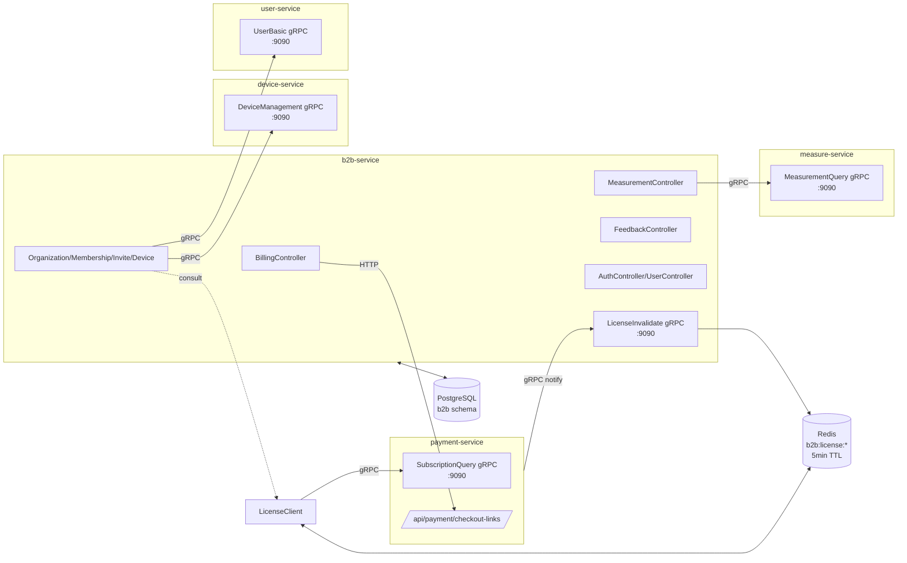
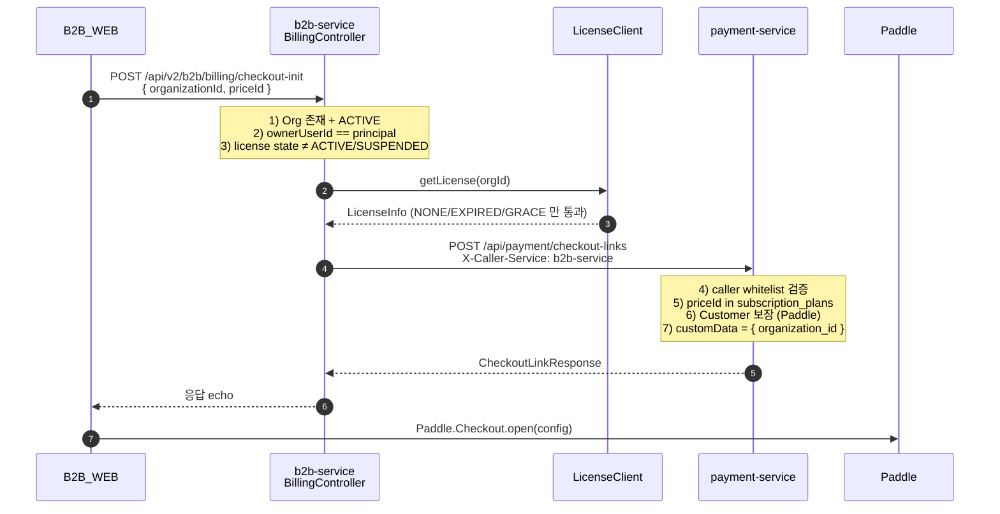
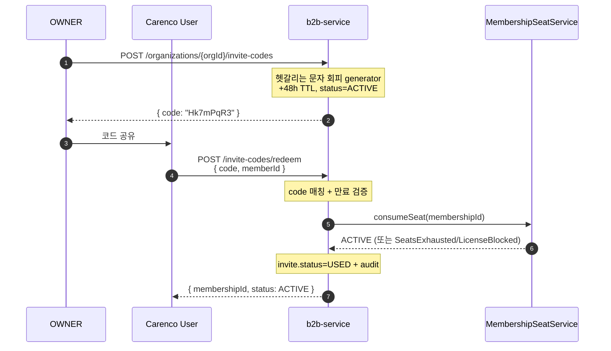
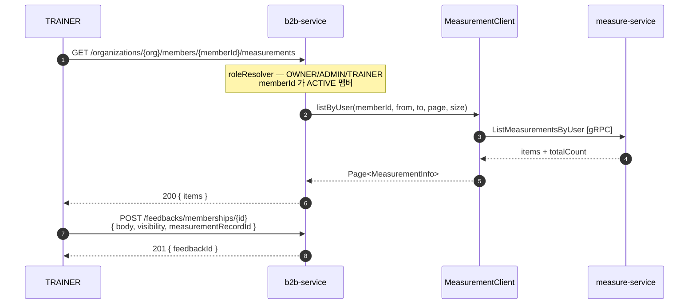
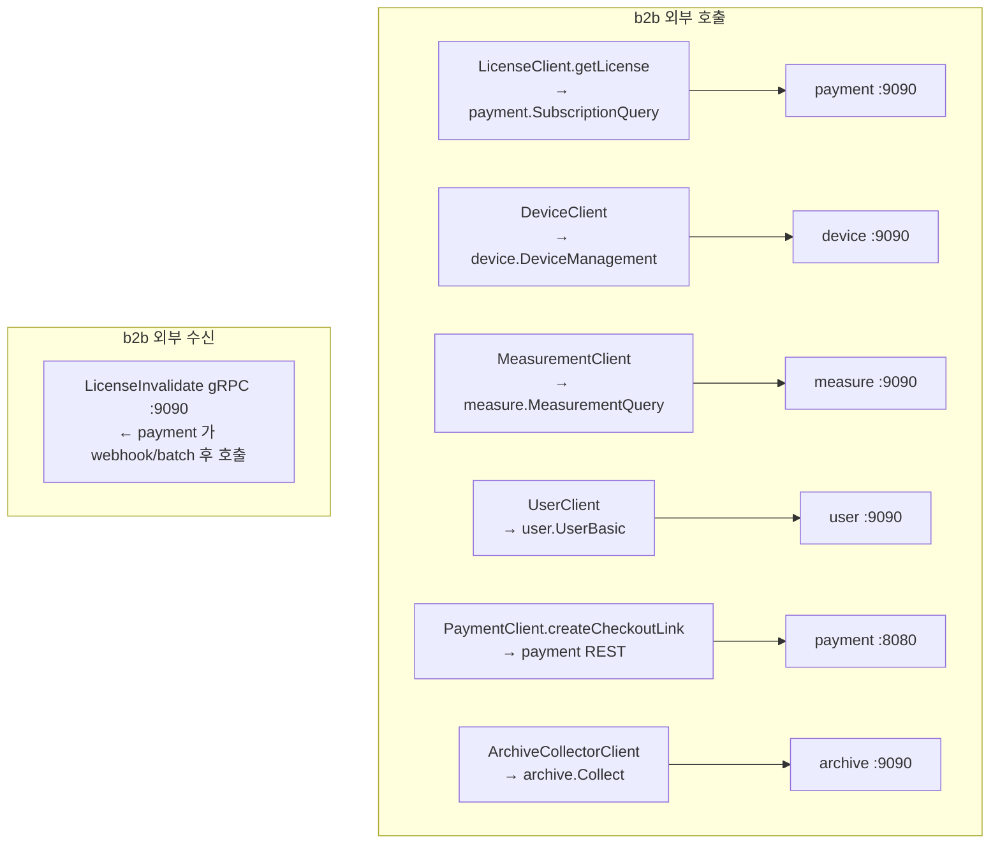
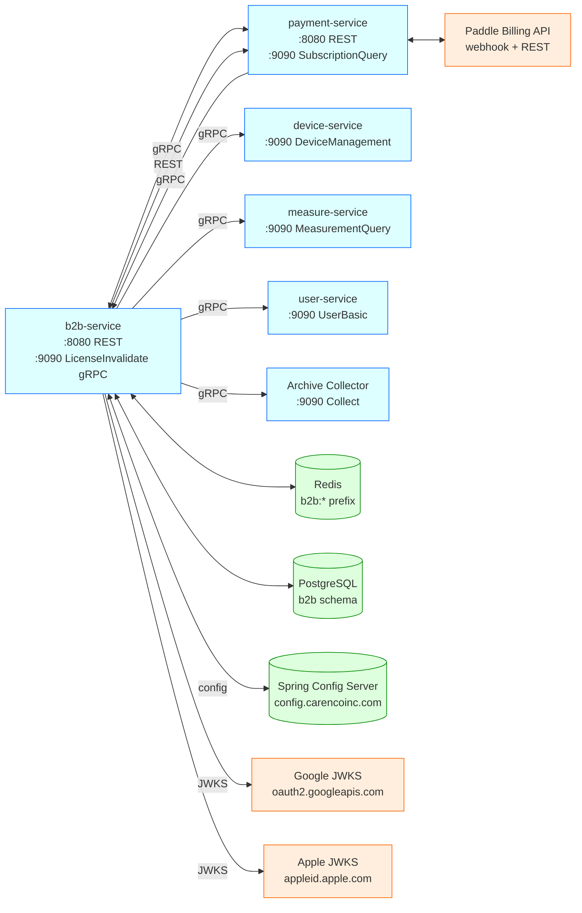
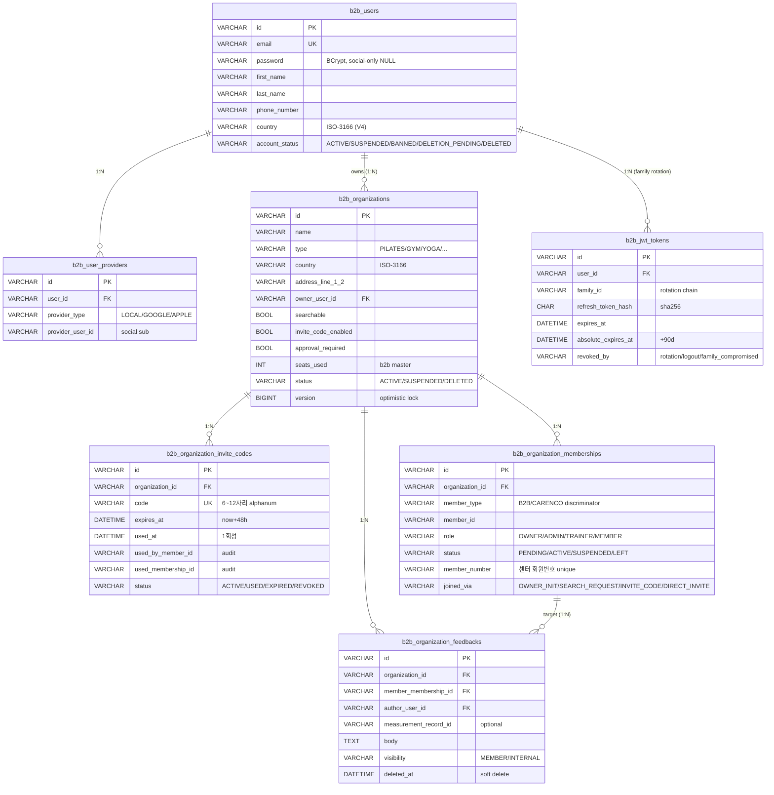

# B2B Service API

> 갱신. 2026-06-08
> 스타일. OpenAPI 3.1 + 다이어그램 + 코드 체인 매핑 + 전체 요청/응답 샘플
> Base path. `/api/v2/b2b/...`
> 응답 envelope. [`CncResponse`](#71-cncresponse-envelope) (Pattern B)
> 권한 매트릭스 (서비스 측). [`b2b-service/docs/authorization.md`](../../../b2b-service/docs/authorization.md)
> 시나리오 (프론트엔드용). [`docs/scenarios/b2b-device-management.md`](../scenarios/b2b-device-management.md)

---

## 1. 개요

운동 시설 (gym/pilates/yoga/PT_studio/crossfit/functional/boxing) B2B 관리 서비스. 관리자 계정 + 시설 + 멤버 + 디바이스 + 측정 데이터 노출 + 피드백 + 결제 진입점.

### 1.1 도메인

| 도메인 | 책임 |
|---|---|
| `auth` | 인증 / 세션 / JWT family rotation / OAuth2 (Google + Apple) |
| `user` | b2b_user (관장/스태프/트레이너) CRUD |
| `organization` | 시설 + 초대 코드 + 멤버십 lifecycle (master) + 회원목록 enrich |
| `feedback` | 트레이너 → 회원 피드백 (visibility=MEMBER/INTERNAL) |
| `external/license` | payment-service gRPC 소비 + Redis 캐시 + LicenseGuard + invalidate 수신 |
| `external/device` | device-service gRPC wrap |
| `external/measurement` | measure-service gRPC wrap |
| `external/user` | user-service gRPC wrap (회원목록 enrich) |
| `external/payment` | payment-service REST 호출 (결제 시작) |
| `billing` | 결제 진입 — OWNER 검증 후 payment 위임 |
| `archive` | account 탈퇴/멤버십 LEFT 의 outbox + Carenco Archive Collector gRPC publish |

### 1.2 외부 의존



---

## 2. Architecture — Cross-MSA 데이터 흐름

### 2.1 결제 시작 (Billing)



### 2.2 회원 가입 + 좌석 점유 (검색 + 승인)


### 2.3 초대 코드 1회성 가입



### 2.4 측정 데이터 + 피드백 (트레이너)



### 2.5 License invalidate (양방향 sync)

```mermaid
sequenceDiagram
    Paddle->>P payment-service: subscription.canceled
    P->>P: subscriptions.status=CANCELED
    P->>+B b2b-service: InvalidateLicense(orgId) [gRPC]
    B->>Redis: DEL b2b:license:{orgId}
    B-->>-P: { invalidated: true }
    Note over Paddle,B: 다음 b2b 의 getLicense 호출 시<br/>새 상태 즉시 반영
```

### 2.6 자정 batch (PAST_DUE → EXPIRED)

```mermaid
sequenceDiagram
    Note over P: 매일 00:05 KST cron<br/>+ ShedLock JDBC 분산락
    P->>P: findByStatusAndNextBilledAtBefore(PAST_DUE, now-7d)
    P->>P: 모두 status=EXPIRED 로 update
    P->>+B b2b-service: InvalidateMany([orgIds]) [gRPC]
    B->>Redis: DEL multiple keys
    B-->>-P: { invalidatedCount, notCachedCount }
```

---

## 3. Endpoint Catalog

표기. 🔓 Public / 🔒 Auth / 👑 OWNER/ADMIN / 👥 OWNER/ADMIN/TRAINER / 🧍 self only.

| # | Method | Path | 권한 | 코드 매핑 |
|---|---|---|---|---|
| 1 | POST | `/api/v2/b2b/auth/login` | 🔓 | [§4.1](#41-post-apiv2b2bauthlogin) |
| 2 | POST | `/api/v2/b2b/auth/token` | 🔓 | [§4.2](#42-post-apiv2b2bauthtoken) |
| 3 | POST | `/api/v2/b2b/auth/logout` | 🔒 | [§4.3](#43-post-apiv2b2bauthlogout) |
| 4 | POST | `/api/v2/b2b/auth/oauth2/google` | 🔓 | [§4.5](#45-post-apiv2b2bauthoauth2google) |
| 5 | POST | `/api/v2/b2b/auth/oauth2/apple` | 🔓 | [§4.6](#46-post-apiv2b2bauthoauth2apple) |
| 6 | POST | `/api/v2/b2b/users` | 🔓 | [§4.7](#47-post-apiv2b2busers) |
| 7 | GET | `/api/v2/b2b/users/{b2bUserId}` | 🧍 | [§4.8](#48-get-apiv2b2busersb2buserid) |
| 8 | PATCH | `/api/v2/b2b/users/{b2bUserId}` | 🧍 | [§4.9](#49-patch-apiv2b2busersb2buserid) |
| 9 | POST | `/api/v2/b2b/users/{b2bUserId}/password` | 🧍 | [§4.10](#410-post-apiv2b2busersb2buseridpassword) |
| 10 | DELETE | `/api/v2/b2b/users/{b2bUserId}` | 🧍 | [§4.11](#411-delete-apiv2b2busersb2buserid) |
| 11 | POST | `/api/v2/b2b/organizations` | 🔒 | [§4.12](#412-post-apiv2b2borganizations) |
| 12 | GET | `/api/v2/b2b/organizations/{id}` | 🔓 | [§4.13](#413-get-apiv2b2borganizationsid) |
| 13 | PATCH | `/api/v2/b2b/organizations/{id}` | 👑 | [§4.14](#414-patch-apiv2b2borganizationsid) |
| 14 | DELETE | `/api/v2/b2b/organizations/{id}` | 👑 | [§4.15](#415-delete-apiv2b2borganizationsid) |
| 15 | GET | `/api/v2/b2b/organizations/search` | 🔓 | [§4.16](#416-get-apiv2b2borganizationssearch) |
| 16 | POST | `/api/v2/b2b/organizations/{orgId}/join-requests` | 🔓 | [§4.18](#418-post-apiv2b2borganizationsorgidjoin-requests) |
| 17 | POST | `/api/v2/b2b/memberships/{id}/approve` | 👑 | [§4.19](#419-post-apiv2b2bmembershipsidapprove) |
| 18 | POST | `/api/v2/b2b/memberships/{id}/reject` | 👑 | [§4.20](#420-post-apiv2b2bmembershipsidreject) |
| 19 | POST | `/api/v2/b2b/memberships/{id}/suspend` | 👑 | [§4.21](#421-post-apiv2b2bmembershipsidsuspend) |
| 20 | POST | `/api/v2/b2b/memberships/{id}/leave` | 🔓 | [§4.22](#422-post-apiv2b2bmembershipsidleave) |
| 21 | POST | `/api/v2/b2b/organizations/{orgId}/staff` | 👑 | [§4.23](#423-post-apiv2b2borganizationsorgidstaff) |
| 22 | GET | `/api/v2/b2b/organizations/{orgId}/members` | 👥 | [§4.24](#424-get-apiv2b2borganizationsorgidmembers) |
| 23 | POST | `/api/v2/b2b/organizations/{orgId}/invite-codes` | 👑 | [§4.25](#425-post-apiv2b2borganizationsorgidinvite-codes) |
| 24 | GET | `/api/v2/b2b/organizations/{orgId}/invite-codes` | 🔒 | [§4.26](#426-get-apiv2b2borganizationsorgidinvite-codes) |
| 25 | POST | `/api/v2/b2b/invite-codes/{id}/revoke` | 👑 | [§4.27](#427-post-apiv2b2binvite-codesidrevoke) |
| 26 | POST | `/api/v2/b2b/invite-codes/redeem` | 🔓 | [§4.28](#428-post-apiv2b2binvite-codesredeem) |
| 27 | POST | `/api/v2/b2b/organizations/{orgId}/devices` | 👑 | [§4.29](#429-post-apiv2b2borganizationsorgiddevices) |
| 28 | GET | `/api/v2/b2b/organizations/{orgId}/devices` | 🔒 | [§4.30](#430-get-apiv2b2borganizationsorgiddevices) |
| 29 | GET | `/api/v2/b2b/organizations/{orgId}/devices/{deviceId}` | 🔒 | [§4.31](#431-get-apiv2b2borganizationsorgiddevicesdeviceid) |
| 30 | PATCH | `/api/v2/b2b/organizations/{orgId}/devices/{deviceId}` | 👑 | [§4.32](#432-patch-apiv2b2borganizationsorgiddevicesdeviceid) |
| 31 | POST | `/api/v2/b2b/organizations/{orgId}/devices/{deviceId}/deactivate` | 👑 | [§4.33](#433-post-apiv2b2borganizationsorgiddevicesdeviceiddeactivate) |
| 31a | GET | `/api/v2/b2b/organizations/{orgId}/devices/preview?serial=...` | 👑 | [§4.33.1](#4331-get-devicespreview-new-in-0061) |
| 31b | DELETE | `/api/v2/b2b/organizations/{orgId}/devices/{deviceId}?reason=...` | 👑 | [§4.33.2](#4332-delete-devicesdeviceid-new-in-0061) |
| 32 | GET | `…/members/{memberId}/measurements` | 👥 | [§4.34](#434-get-apiv2b2borganizationsorgidmembersmemberidmeasurements) |
| 33 | GET | `…/measurements/{recordId}` | 👥 | [§4.35](#435-get-apiv2b2borganizationsorgidmembersmemberidmeasurementsrecordid) |
| 34 | GET | `…/measurements/summary` | 👥 | [§4.36](#436-get-apiv2b2borganizationsorgidmembersmemberidmeasurementssummary) |
| 35 | POST | `/api/v2/b2b/feedbacks/memberships/{id}` | 👥 | [§4.37](#437-post-apiv2b2bfeedbacksmembershipsid) |
| 36 | PATCH | `/api/v2/b2b/feedbacks/{id}` | 작성자 | [§4.38](#438-patch-apiv2b2bfeedbacksid) |
| 37 | DELETE | `/api/v2/b2b/feedbacks/{id}` | 작성자 | [§4.39](#439-delete-apiv2b2bfeedbacksid) |
| 38 | GET | `/api/v2/b2b/feedbacks/memberships/{id}` | 🔒 | [§4.40](#440-get-apiv2b2bfeedbacksmembershipsid) |
| 39 | GET | `/api/v2/b2b/feedbacks/measurements/{recordId}` | 🔒 | [§4.41](#441-get-apiv2b2bfeedbacksmeasurementsrecordid) |
| 40 | GET | `/api/v2/b2b/license-summary` | 🔒 | [§4.42](#442-get-apiv2b2blicense-summary) |
| 41 | GET | `/api/v2/b2b/license-summary/{orgId}` | 🔒 | [§4.43](#443-get-apiv2b2blicense-summaryorgid) |
| 42 | POST | `/api/v2/b2b/billing/checkout-init` | 👑 | [§4.44](#444-post-apiv2b2bbillingcheckout-init) |
| 43 | POST | `/api/v2/b2b/billing/plan-change` | 👑 | [§4.45](#445-post-apiv2b2bbillingplan-change) |
| 44 | GET | `/api/v2/b2b/billing/organizations/{orgId}/transactions` | 👑 | [§4.46](#446-get-apiv2b2bbillingorganizationsorgidtransactions) |

전 응답은 [`CncResponse`](#71-cncresponse-envelope) envelope 으로 감싸진다. 본 문서의 응답 샘플은 envelope 전체를 보여 준다.

> § 4.4 (`GET /auth/me`), § 4.17 (`GET /organizations/mine`) 은 코드에서 제거됨 — 표 번호는 코드 기준 44개. § 번호는 결번 (변경 추적 용이).

---

## 4. Endpoint Detail

### 4.1 `POST /api/v2/b2b/auth/login`

로그인. `X-Client-Type` 헤더로 web 세션 / 모바일 토큰 분기.

**권한** 🔓.

**Headers**
| 헤더 | 값 | 설명 |
|---|---|---|
| `X-Client-Type` | `web` 또는 미지정 | `web` → Spring Session Cookie 발급. 그 외 → mobile token 발급 (default). |

**요청 바디** — `LoginRequest`

```json
{
  "email": "owner@example.com",
  "password": "P@ssw0rd123",
  "deviceId": "iphone-15-uuid",
  "deviceType": "iOS"
}
```

검증. `email` ValidEmail, `password` NotBlank. `deviceId`/`deviceType` optional (rotation 추적용).

**응답 — 200 (mobile)** — `TokenPair`

```json
{
  "success": true, "code": "200", "message": "OK",
  "data": {
    "userId": "u-9f3e",
    "accessToken": "eyJhbGciOiJIUzI1NiJ9...",
    "refreshToken": "rt_2f81a3..."
  }
}
```

**응답 — 200 (web, `X-Client-Type: web`)**

```json
{
  "success": true, "code": "200", "message": "OK",
  "data": {
    "userId": "u-9f3e",
    "email": "owner@example.com",
    "sessionId": "F3D2..."
  }
}
```

추가로 `Set-Cookie: SESSION=...; HttpOnly` 가 발급된다.

**에러**
| HTTP | 코드 | 케이스 |
|---|---|---|
| 401 | `AUTH-401-003` | 비밀번호 불일치 / 미가입 |
| 403 | `AUTH-403-003` | 계정 SUSPENDED / DELETION_PENDING |

---

### 4.2 `POST /api/v2/b2b/auth/token`

refresh token rotation. 모바일에서 access token 만료 시 호출. family rotation — 같은 refresh 재사용 시 family 전체 폐기.

**권한** 🔓 (refresh token 자체로 인증).

**요청 바디** — `RefreshRequest`

```json
{
  "refreshToken": "rt_2f81a3...",
  "deviceId": "iphone-15-uuid",
  "deviceType": "iOS"
}
```

**응답 — 200** — `TokenPair` (새 access + rotated refresh)

```json
{
  "success": true, "code": "200", "message": "OK",
  "data": {
    "userId": "u-9f3e",
    "accessToken": "eyJhbGciOiJIUzI1NiJ9.NEW...",
    "refreshToken": "rt_NEW_a8b9c..."
  }
}
```

**에러**
| HTTP | 코드 | 케이스 |
|---|---|---|
| 401 | `AUTH-401-001` | refresh token 무효 / 만료 / 이미 rotated (family compromised) |

---

### 4.3 `POST /api/v2/b2b/auth/logout`

JTI revocation + (web 흐름) Session invalidate.

**권한** Authorization 헤더 또는 Cookie 중 어느 한쪽.

**Headers**
| 헤더 | 값 |
|---|---|
| `Authorization` | `Bearer eyJ...` (모바일) — access 의 jti 를 revoke list 에 추가 |

**요청 바디** — `LogoutRequest` (optional — refresh family 까지 폐기하려면 전달)

```json
{ "refreshToken": "rt_2f81a3..." }
```

**응답 — 200**

```json
{ "success": true, "code": "200", "message": "OK", "data": null }
```

---

### 4.5 `POST /api/v2/b2b/auth/oauth2/google`

Google ID 토큰 검증 후 가입/로그인 후 JWT 발급.

**권한** 🔓. 단, `b2b.oauth2.enabled=true` 설정 시에만 라우트 등록 (false 시 404).

**요청 바디** — `OAuth2LoginRequest`

```json
{
  "idToken": "eyJhbGciOiJSUzI1NiIsImtpZCI6IjEy...",
  "deviceId": "iphone-15-uuid",
  "deviceType": "iOS"
}
```

**응답 — 200** — `TokenPair` (4.1 모바일 응답과 동일 shape).

**에러** (`OAuth2Error`)
| HTTP | 코드 | 케이스 |
|---|---|---|
| 401 | `AUTH-401-001` | InvalidIdToken — 서명/만료/issuer 불일치 |
| 401 | `AUTH-401-001` | InvalidAudience — aud 가 b2b clientId 와 다름 |
| 400 | `CMN-400-001` | EmailMissing — Google 가 이메일 미제공 |
| 403 | `AUTH-403-003` | AccountSuspended — DELETION_PENDING 등 |
| 502 | `CMN-502-001` | VerifierUnavailable — Google JWKS 다운 |

---

### 4.6 `POST /api/v2/b2b/auth/oauth2/apple`

Apple ID 토큰 검증 후 가입/로그인 후 JWT 발급. 4.5 와 동일 shape, 검증 verifier 만 Apple JWKS.

---

### 4.7 `POST /api/v2/b2b/users`

관리자 회원가입 (이메일 + 비밀번호 + 이름).

**권한** 🔓.

**요청 바디** — `SignUpRequest`

```json
{
  "email": "owner@example.com",
  "password": "P@ssw0rd123",
  "firstName": "박",
  "lastName": "관장",
  "country": "KR",
  "phoneNumber": "+821011112222"
}
```

검증. ValidEmail / ValidPassword (영문/숫자/특수 1자 이상, 8자 이상) / ValidName (한글 또는 영문) / ValidCountryCode (ISO-3166 alpha-2 지원 셋) / ValidPhoneNumber (E.164).

**응답 — 201** — `UserResponse`

```json
{
  "success": true, "code": "201", "message": "Created",
  "data": {
    "id": "u-9f3e",
    "email": "owner@example.com",
    "firstName": "박",
    "lastName": "관장",
    "phoneNumber": "+821011112222",
    "country": "KR",
    "profileImageUrl": null,
    "accountStatus": "ACTIVE",
    "lastLoginTime": null,
    "createdAt": "2026-05-13T08:00:00Z",
    "organizations": []
  }
}
```

가입 직후 `organizations: []`. 시설 생성/가입 시 채워짐.

**에러** (`UserError`)
| HTTP | 코드 | 케이스 |
|---|---|---|
| 409 | `CMN-409-001` | EmailDuplicate |
| 400 | `CMN-400-001` | InvalidPasswordFormat |

---

### 4.8 `GET /api/v2/b2b/users/{b2bUserId}`

본인 프로필 + 소속 organization (multi-org, license 포함).

**권한** 🧍 — path 의 `b2bUserId` 가 인증된 principal 과 일치해야 함. 불일치 시 403.

**응답 — 200** — `UserResponse` (with `organizations[]`)

```json
{
  "success": true, "code": "200", "message": "OK",
  "data": {
    "id": "u-9f3e",
    "email": "owner@example.com",
    "firstName": "박",
    "lastName": "관장",
    "phoneNumber": "+821011112222",
    "country": "KR",
    "profileImageUrl": "https://cdn.carenco.com/u/9f3e.jpg",
    "accountStatus": "ACTIVE",
    "lastLoginTime": "2026-05-13T07:30:00Z",
    "createdAt": "2026-01-02T00:00:00Z",
    "organizations": [
      {
        "id": "org-A",
        "name": "강남점",
        "type": "PILATES",
        "role": "OWNER",
        "seatsUsed": 12,
        "planSeats": 50,
        "licenseState": "ACTIVE"
      },
      {
        "id": "org-B",
        "name": "분당점",
        "type": "PILATES",
        "role": "ADMIN",
        "seatsUsed": 7,
        "planSeats": 30,
        "licenseState": "GRACE"
      }
    ]
  }
}
```

**에러** (`UserError`)
| HTTP | 코드 | 케이스 |
|---|---|---|
| 403 | `AUTH-403-002` | NotSelf — path != principal |
| 404 | `USR-404-001` | NotFound |
| 403 | `AUTH-403-003` | AccountInactive — DELETION_PENDING |

**연쇄 호출**

```
UserController.get → ensureSelf(pathUserId, principal)
            → UserService.getMeWithOrganizations
  ├─ B2bUserRepository.findById
  ├─ OrganizationRepository.findByOwnerUserId (OWNER orgs)
  ├─ OrganizationMembershipRepository.findByMemberTypeAndMemberId(B2B, userId)
  └─ LicenseClient.batchGetLicense (한 번에 조회)
       ├─ Redis cache hits → 즉시
       └─ miss → payment-service gRPC BatchGetLicenseStatus
```

---

### 4.9 `PATCH /api/v2/b2b/users/{b2bUserId}`

프로필 부분 수정. JsonNullable 의 3-state semantics 사용.

**권한** 🧍.

**요청 바디** — `UpdateProfileRequest`

| field | 동작 |
|---|---|
| undefined (키 없음) | 변경 없음 |
| `"field": null` | 컬럼 NULL 로 설정 (firstName/lastName/searchable 류는 거부) |
| `"field": value` | 적용 |

```json
{
  "phoneNumber": "+821033334444",
  "profileImageUrl": "https://cdn.carenco.com/u/9f3e-new.jpg",
  "country": "JP"
}
```

(firstName/lastName 은 ValidName + JsonNullableNonNull — null 로 설정 불가)

**응답 — 200** — `UserResponse` (변경 후 전체 상태).

**에러** (`UserError`)
| HTTP | 코드 | 케이스 |
|---|---|---|
| 403 | `AUTH-403-002` | NotSelf |
| 404 | `USR-404-001` | NotFound |

---

### 4.10 `POST /api/v2/b2b/users/{b2bUserId}/password`

비밀번호 변경. 변경 성공 시 모든 session/token 폐기.

**권한** 🧍.

**요청 바디** — `ChangePasswordRequest`

```json
{
  "currentPassword": "P@ssw0rd123",
  "newPassword": "NewP@ssw0rd456"
}
```

**응답 — 204** (body 없음, envelope 없음).

**에러** (`UserError`)
| HTTP | 코드 | 케이스 |
|---|---|---|
| 401 | `AUTH-401-003` | InvalidCurrentPassword |
| 400 | `CMN-400-001` | InvalidPasswordFormat |
| 400 | `CMN-400-001` | SamePasswordReuse |
| 403 | `AUTH-403-002` | NotSelf |

---

### 4.11 `DELETE /api/v2/b2b/users/{b2bUserId}`

soft 탈퇴 — `accountStatus=DELETION_PENDING` + 모든 세션 폐기. archive outbox 가 비동기로 Carenco Archive Collector 에 publish.

**권한** 🧍.

**응답 — 204**.

**에러**. 4.9 와 동일 (NotSelf / NotFound).

---

### 4.12 `POST /api/v2/b2b/organizations`

시설 등록. 호출한 b2b_user 가 OWNER 로 자동 멤버십 생성 (`joinedVia=OWNER_INIT`).

**권한** 🔒.

**요청 바디** — `CreateOrganizationRequest`

```json
{
  "name": "강남점",
  "type": "PILATES",
  "description": "강남구 신논현역 5분 거리",
  "phoneNumber": "+82215551234",
  "photoUrl": "https://cdn.carenco.com/org/gangnam.jpg",
  "country": "KR",
  "postalCode": "06000",
  "regionLevel1": "서울",
  "regionLevel2": "강남구",
  "addressLine1": "테헤란로 123",
  "addressLine2": "456호",
  "searchable": true,
  "inviteCodeEnabled": true,
  "approvalRequired": true
}
```

`OrganizationType` enum. `GYM | PILATES | YOGA | PT_STUDIO | CROSSFIT | FUNCTIONAL | BOXING | ETC`.

**응답 — 201** — `OrganizationResponse`

```json
{
  "success": true, "code": "201", "message": "Created",
  "data": {
    "id": "org-A",
    "name": "강남점",
    "type": "PILATES",
    "description": "강남구 신논현역 5분 거리",
    "phoneNumber": "+82215551234",
    "photoUrl": "https://cdn.carenco.com/org/gangnam.jpg",
    "address": {
      "country": "KR",
      "postalCode": "06000",
      "regionLevel1": "서울",
      "regionLevel2": "강남구",
      "addressLine1": "테헤란로 123",
      "addressLine2": "456호"
    },
    "ownerUserId": "u-9f3e",
    "searchable": true,
    "inviteCodeEnabled": true,
    "approvalRequired": true,
    "seatsUsed": 0,
    "status": "ACTIVE"
  }
}
```

**에러** (`OrganizationError`)
| HTTP | 코드 | 케이스 |
|---|---|---|
| 400 | `CMN-400-001` | InvalidInput |

---

### 4.13 `GET /api/v2/b2b/organizations/{id}`

단건 조회 (공개).

**권한** 🔓.

**응답 — 200** — `OrganizationResponse` (4.12 와 동일 shape).

**에러**
| HTTP | 코드 | 케이스 |
|---|---|---|
| 404 | `CMN-404-001` | NotFound |

---

### 4.14 `PATCH /api/v2/b2b/organizations/{id}`

부분 수정 (owner 만). JsonNullable 의 3-state semantics.

**권한** 👑 (OWNER).

**요청 바디** — `UpdateOrganizationRequest`

```json
{
  "name": "강남점 리뉴얼",
  "description": null,
  "searchable": false,
  "inviteCodeEnabled": true,
  "approvalRequired": false
}
```

NotNullable. `name`, `type`, `searchable`, `inviteCodeEnabled`, `approvalRequired`.

**응답 — 200** — `OrganizationResponse`.

**에러**
| HTTP | 코드 | 케이스 |
|---|---|---|
| 404 | `CMN-404-001` | NotFound |
| 403 | `AUTH-403-002` | NotOwner |

---

### 4.15 `DELETE /api/v2/b2b/organizations/{id}`

soft 삭제 (owner 만). `status=DELETED` + 모든 멤버십 LEFT + 모든 invite code REVOKED cascade. archive outbox 비동기 publish.

**권한** 👑 (OWNER).

**응답 — 204**.

**에러** (`OrganizationError`)
| HTTP | 코드 | 케이스 |
|---|---|---|
| 404 | `CMN-404-001` | NotFound |
| 403 | `AUTH-403-002` | NotOwner |

---

### 4.16 `GET /api/v2/b2b/organizations/search`

`searchable=true` + `status=ACTIVE` 시설 검색.

**권한** 🔓.

**Query 파라미터**
| 이름 | 타입 | 기본 |
|---|---|---|
| `keyword` | string | 이름/주소 LIKE 매칭 |
| `type` | `OrganizationType` | optional |
| `page` | int | 0 |
| `size` | int | 20 |

**응답 — 200**

```json
{
  "success": true, "code": "200", "message": "OK",
  "data": {
    "items": [
      {
        "id": "org-A",
        "name": "강남점",
        "type": "PILATES",
        "description": "...",
        "phoneNumber": "+82215551234",
        "photoUrl": "...",
        "address": { "country": "KR", "postalCode": "06000",
          "regionLevel1": "서울", "regionLevel2": "강남구",
          "addressLine1": "...", "addressLine2": "..." },
        "ownerUserId": "u-9f3e",
        "searchable": true, "inviteCodeEnabled": true, "approvalRequired": true,
        "seatsUsed": 12, "status": "ACTIVE"
      }
    ],
    "page": 0,
    "size": 20,
    "totalElements": 1,
    "totalPages": 1,
    "hasNext": false
  }
}
```

---

### 4.18 `POST /api/v2/b2b/organizations/{orgId}/join-requests`

Carenco user 가 가입 신청. `searchable=true` 시설만 가능.

**권한** 🔓 (body 의 `memberId` 가 carenco user uuid).

**요청 바디** — `MembershipController.JoinRequest`

```json
{
  "memberId": "carenco-user-uuid",
  "note": "5월 한 달 등록 희망합니다"
}
```

**응답 — 201** — `MembershipResponse` (status=PENDING)

```json
{
  "success": true, "code": "201", "message": "Created",
  "data": {
    "id": "m-7c1d",
    "organizationId": "org-A",
    "memberType": "CARENCO",
    "memberId": "carenco-user-uuid",
    "role": "MEMBER",
    "status": "PENDING",
    "memberNumber": null,
    "joinedVia": "SEARCH_REQUEST",
    "inviteCodeId": null,
    "approvedBy": null,
    "approvedAt": null,
    "joinedAt": null,
    "leftAt": null,
    "note": "5월 한 달 등록 희망합니다"
  }
}
```

**에러** (`MembershipFlowError`)
| HTTP | 코드 | 케이스 |
|---|---|---|
| 404 | `CMN-404-001` | OrganizationNotFound |
| 403 | `AUTH-403-001` | OrganizationNotSearchable |
| 409 | `CMN-409-001` | AlreadyMember |

---

### 4.19 `POST /api/v2/b2b/memberships/{membershipId}/approve`

PENDING → ACTIVE. 좌석 +1 + license guard.

**권한** 👑.

**응답 — 200** — `MembershipResponse`

```json
{
  "success": true, "code": "200", "message": "OK",
  "data": {
    "id": "m-7c1d",
    "organizationId": "org-A",
    "memberType": "CARENCO",
    "memberId": "carenco-user-uuid",
    "role": "MEMBER",
    "status": "ACTIVE",
    "memberNumber": "M260608-001",
    "joinedVia": "SEARCH_REQUEST",
    "approvedBy": "u-9f3e",
    "approvedAt": "2026-05-13T09:10:00Z",
    "joinedAt": "2026-05-13T09:10:00Z",
    "leftAt": null,
    "note": null,
    "inviteCodeId": null
  }
}
```

**에러** (`MembershipFlowError`)
| HTTP | 코드 | 케이스 |
|---|---|---|
| 404 | `CMN-404-001` | MembershipNotFound |
| 403 | `AUTH-403-002` | NotOwnerOrAdmin |
| 409 | `CMN-409-001` | InvalidStateTransition |
| 409 | `CMN-409-001` | AlreadyMember |
| 403 | `LIC-403-001` | SeatConsumeFailed (NO_SEATS_REMAINING — license SUSPENDED / 만석) |

**연쇄 호출**

```
MembershipController.approve → MembershipFlowService.approve
  ├─ MembershipRoleResolver.resolve (역할 확인)
  ├─ MembershipFlowService 내부 검증
  └─ MembershipSeatService.consumeSeat
       ├─ OrganizationRepository.findById
       ├─ LicenseClient.getLicense
       ├─ LicenseGuard.allowSeatConsumption
       ├─ organization.setSeatsUsed (+1, optimistic lock)
       └─ membership.setStatus(ACTIVE)
```

---

### 4.20 `POST /api/v2/b2b/memberships/{membershipId}/reject`

PENDING → LEFT (좌석 차감 없음).

**권한** 👑.

**응답 — 200** — `MembershipResponse` (status=LEFT, leftAt 채워짐).

**에러**
| HTTP | 코드 | 케이스 |
|---|---|---|
| 404 | `CMN-404-001` | MembershipNotFound |
| 403 | `AUTH-403-002` | NotOwnerOrAdmin |
| 409 | `CMN-409-001` | InvalidStateTransition |

---

### 4.21 `POST /api/v2/b2b/memberships/{membershipId}/suspend`

ACTIVE → SUSPENDED.

**권한** 👑.

**요청 바디** — `MembershipController.SuspendRequest` (optional)

```json
{ "reason": "회비 연체 3개월" }
```

**응답 — 200** — `MembershipResponse` (status=SUSPENDED).

**에러**. 4.20 와 동일.

---

### 4.22 `POST /api/v2/b2b/memberships/{membershipId}/leave`

본인 탈퇴. body 의 `requesterId` 와 멤버십의 `memberId` 가 일치해야 함. 좌석 −1 + archive outbox publish.

**권한** 🔓 (body 자기검증).

**요청 바디** — `MembershipController.LeaveRequest`

```json
{ "requesterId": "carenco-user-uuid" }
```

**응답 — 200** — `MembershipResponse` (status=LEFT).

**에러**
| HTTP | 코드 | 케이스 |
|---|---|---|
| 404 | `CMN-404-001` | MembershipNotFound |
| 409 | `CMN-409-001` | InvalidStateTransition |

---

### 4.23 `POST /api/v2/b2b/organizations/{orgId}/staff`

OWNER/ADMIN 이 기존 b2b_user 를 staff 로 지정. role 은 ADMIN 또는 TRAINER.

**권한** 👑.

**요청 바디** — `MembershipController.AppointStaffRequest`

```json
{
  "b2bUserId": "u-staff-1",
  "role": "TRAINER",
  "memberNumber": "T260608-001"
}
```

**응답 — 201** — `MembershipResponse`

```json
{
  "success": true, "code": "201", "message": "Created",
  "data": {
    "id": "m-staff-1",
    "organizationId": "org-A",
    "memberType": "B2B",
    "memberId": "u-staff-1",
    "role": "TRAINER",
    "status": "ACTIVE",
    "memberNumber": "T260608-001",
    "joinedVia": "DIRECT_INVITE",
    "inviteCodeId": null,
    "approvedBy": "u-9f3e",
    "approvedAt": "2026-05-13T09:30:00Z",
    "joinedAt": "2026-05-13T09:30:00Z",
    "leftAt": null,
    "note": null
  }
}
```

**에러** (`MembershipFlowError`)
| HTTP | 코드 | 케이스 |
|---|---|---|
| 403 | `AUTH-403-002` | NotOwnerOrAdmin |
| 400 | `CMN-400-001` | InvalidRoleAssignment (OWNER 부여 시도 등) |
| 409 | `CMN-409-001` | AlreadyMember |

---

### 4.24 `GET /api/v2/b2b/organizations/{orgId}/members`

회원 목록 (membership + user-service 정보 + measurement 요약). PDF 흐름 4.

**권한** 👥. user/measure-service 장애 시 user/measurement 필드는 null — membership 정보만 노출 (graceful degradation).

**Query 파라미터**
| 이름 | 타입 | 기본 |
|---|---|---|
| `query` | string | 이름 부분일치 (user-service `SearchUsers` 4가지 결합 매칭 — firstName+lastName / lastName+firstName / firstName / lastName, 공백 무시) |
| `include_nickname` | boolean | `false` (true 시 `query` 매칭에 nickname 포함) |
| `sort_by` | `NAME` / `REGISTERED_AT` / `LATEST_MEASUREMENT` | `REGISTERED_AT` |
| `status` | `MembershipStatus` | `ACTIVE` |
| `page` | int | 0 |
| `size` | int | 20 (max 100) |

> 0.0.52 에서 phone_number 매칭은 user-service 측에서 제거됨 — 이름/nickname 만 검색 가능.

**응답 — 200** — `MemberListResponse`

```json
{
  "success": true, "code": "200", "message": "OK",
  "data": {
    "items": [
      {
        "membershipId": "m-7c1d",
        "memberId": "carenco-user-uuid",
        "memberNumber": "M260608-001",
        "role": "MEMBER",
        "status": "ACTIVE",
        "joinedAt": "2026-05-13T09:10:00Z",

        "name": "김회원",
        "nickname": "kimkim",
        "email": "kim@example.com",
        "phoneNumber": "+821022223333",
        "photoUrl": "https://cdn.carenco.com/u/kim.jpg",
        "birthdate": "1995-03-15",
        "gender": "FEMALE",
        "countryCode": "KR",
        "height": 165.0,

        "totalMeasurements": 12,
        "currentMonthMeasurements": 3,
        "lastMeasuredAt": "2026-05-10T08:00:00Z",
        "lastWeight": 54.2,
        "lastBodyScore": 78.5
      }
    ],
    "totalCount": 47,
    "totalReports": 312,
    "hasNext": true
  }
}
```

**에러** (`MemberListError`)
| HTTP | 코드 | 케이스 |
|---|---|---|
| 403 | `AUTH-403-002` | RoleRequired |
| 404 | `CMN-404-001` | OrganizationNotFound |

---

### 4.25 `POST /api/v2/b2b/organizations/{orgId}/invite-codes`

초대 코드 발급. 헷갈리는 문자 (0/O, 1/l/I) 회피 generator. TTL 48h.

**권한** 👑.

**요청 바디** — `IssueInviteCodeRequest`

```json
{
  "description": "5월 신규 회원용",
  "codeLength": 8
}
```

`codeLength` 6~12 (기본 8).

**응답 — 201** — `InviteCodeResponse`

```json
{
  "success": true, "code": "201", "message": "Created",
  "data": {
    "id": "ic-a1b2",
    "organizationId": "org-A",
    "code": "Hk7mPqR3",
    "description": "5월 신규 회원용",
    "expiresAt": "2026-05-15T09:30:00Z",
    "usedAt": null,
    "status": "ACTIVE",
    "createdBy": "u-9f3e"
  }
}
```

**에러** (`InviteCodeError`)
| HTTP | 코드 | 케이스 |
|---|---|---|
| 404 | `CMN-404-001` | OrganizationNotFound |
| 403 | `AUTH-403-002` | NotOwnerOrAdmin |
| 403 | `AUTH-403-001` | InviteCodeDisabled (organization.inviteCodeEnabled=false) |
| 403 | `LIC-403-001` | LicenseBlocked (EXPIRED/SUSPENDED/NONE) |

---

### 4.26 `GET /api/v2/b2b/organizations/{orgId}/invite-codes`

ACTIVE 코드 목록.

**권한** 🔒.

**응답 — 200**

```json
{
  "success": true, "code": "200", "message": "OK",
  "data": {
    "items": [
      { "id": "ic-a1b2", "organizationId": "org-A", "code": "Hk7mPqR3",
        "description": "...", "expiresAt": "2026-05-15T09:30:00Z",
        "usedAt": null, "status": "ACTIVE", "createdBy": "u-9f3e" }
    ]
  }
}
```

---

### 4.27 `POST /api/v2/b2b/invite-codes/{inviteCodeId}/revoke`

수동 폐기 (ACTIVE → REVOKED).

**권한** 👑.

**응답 — 200** — `InviteCodeResponse` (status=REVOKED).

**에러**
| HTTP | 코드 | 케이스 |
|---|---|---|
| 404 | `CMN-404-001` | InviteCodeNotFound |
| 403 | `AUTH-403-002` | NotOwnerOrAdmin |

---

### 4.28 `POST /api/v2/b2b/invite-codes/redeem`

Carenco user 가 코드 입력하여 가입.

**권한** 🔓. body 의 `memberId` 가 carenco userId.

**요청 바디** — `InviteCodeController.RedeemRequest`

```json
{
  "code": "Hk7mPqR3",
  "memberId": "carenco-user-uuid"
}
```

**응답 — 200**

```json
{
  "success": true, "code": "200", "message": "OK",
  "data": {
    "inviteCode": {
      "id": "ic-a1b2", "organizationId": "org-A", "code": "Hk7mPqR3",
      "description": "5월 신규 회원용",
      "expiresAt": "2026-05-15T09:30:00Z",
      "usedAt": "2026-05-13T09:50:00Z",
      "status": "USED",
      "createdBy": "u-9f3e"
    },
    "membershipId": "m-9d4e",
    "organizationId": "org-A",
    "status": "ACTIVE"
  }
}
```

**에러** (`InviteCodeError`)
| HTTP | 코드 | 케이스 |
|---|---|---|
| 404 | `CMN-404-001` | InviteCodeNotFound |
| 410 | `INV-410-001` | InviteCodeExpired |
| 409 | `INV-409-001` | InviteCodeNotActive (USED / REVOKED) |
| 409 | `CMN-409-002` | AlreadyMember |
| 403 | `LIC-403-001` | LicenseBlocked (SeatsExhausted 포함) |

**연쇄 호출**

```
InviteCodeController.redeem → InviteCodeService.redeem
  ├─ InviteCodeRepository.findByCode
  ├─ 만료 검증 (expiresAt < now)
  ├─ 중복 멤버 검증
  ├─ Membership PENDING row 생성
  └─ MembershipSeatService.consumeSeat (license guard + seats+1)
       └─ 성공 시 InviteCode.status=USED + audit
```

---

### 4.29 `POST /api/v2/b2b/organizations/{orgId}/devices`

InBody 등 측정 device 등록. device-service gRPC 위임.

**권한** 👑. license state ACTIVE/GRACE 만.

**요청 바디** — `RegisterDeviceRequest`

```json
{
  "serialNumber": "INBODY-770-2024-0123",
  "alias": "1번 InBody"
}
```

**응답 — 201** — `DeviceResponse`

```json
{
  "success": true, "code": "201", "message": "Created",
  "data": {
    "deviceId": "dev-c3d4",
    "organizationId": "org-A",
    "serialNumber": "INBODY-770-2024-0123",
    "alias": "1번 InBody",
    "status": "ACTIVE",
    "registeredAt": "2026-05-13T10:00:00Z",
    "registeredBy": "u-9f3e",
    "deactivatedAt": null,
    "deactivatedBy": null,
    "deactivationReason": null,
    "lastUsedAt": null
  }
}
```

**에러** (`DeviceError`)
| HTTP | 코드 | 케이스 |
|---|---|---|
| 403 | `AUTH-403-002` | OrgRoleRequired |
| 403 | `LIC-403-001` | LicenseDenied (EXPIRED/SUSPENDED) |

---

### 4.30 `GET /api/v2/b2b/organizations/{orgId}/devices`

device 목록.

**권한** 🔒 (멤버).

**Query 파라미터**
| 이름 | 타입 | 설명 |
|---|---|---|
| `keyword` | string | serialNumber / alias 부분일치 |
| `status` | `DeviceStatus` (`ACTIVE` / `INACTIVE`) | 필터 |
| `sortBy` | string | `name` / `registered_at` (default DESC) / `last_used` / **`battery`** (0.0.61, NULLS LAST) |

**응답 — 200**

```json
{
  "success": true, "code": "200", "message": "OK",
  "data": {
    "items": [
      {
        "deviceId": "dev-c3d4",
        "organizationId": "org-A",
        "serialNumber": "INBODY-770-2024-0123",
        "alias": "1번 InBody",
        "status": "ACTIVE",
        "registeredAt": "2026-05-13T10:00:00Z",
        "registeredBy": "u-9f3e",
        "deactivatedAt": null,
        "deactivatedBy": null,
        "deactivationReason": null,
        "lastUsedAt": "2026-05-13T11:20:00Z",
        "batteryLevel": 87,
        "batteryReportedAt": "2026-05-13T11:20:00Z"
      }
    ]
  }
}
```

`batteryLevel` / `batteryReportedAt` 는 0.0.61 추가. 측정 record 가 저장될 때마다 ML 응답의 battery 가 fire-and-forget 으로 갱신됨. 측정 이력 없는 device 는 둘 다 `null`.

**에러**
| HTTP | 코드 | 케이스 |
|---|---|---|
| 403 | `AUTH-403-002` | NotMember |

---

### 4.31 `GET /api/v2/b2b/organizations/{orgId}/devices/{deviceId}`

device 단건.

**권한** 🔒 (멤버).

**응답 — 200** — `DeviceResponse` (4.29 와 동일).

**에러**
| HTTP | 코드 | 케이스 |
|---|---|---|
| 404 | `CMN-404-001` | DeviceNotInOrg |

---

### 4.32 `PATCH /api/v2/b2b/organizations/{orgId}/devices/{deviceId}`

alias 만 변경 가능. device-service gRPC 가 `alias=null` 을 "변경 없음" 으로 해석 → `null` 거부 (JsonNullableNonNull).

**권한** 👑.

**요청 바디** — `UpdateDeviceRequest`

```json
{ "alias": "1번 InBody (대기실)" }
```

**응답 — 200** — `DeviceResponse`.

---

### 4.33 `POST /api/v2/b2b/organizations/{orgId}/devices/{deviceId}/deactivate`

device 비활성화 (status=INACTIVE).

**권한** 👑.

**요청 바디** — `DeactivateDeviceRequest` (optional)

```json
{ "reason": "수리 입고" }
```

**응답 — 200** — `DeviceResponse` (status=INACTIVE, deactivatedAt/deactivatedBy 채워짐).

---

### 4.33.1 `GET .../devices/preview` (0.0.61 신규)

시리얼만으로 풀 조회 — 등록 전 미리보기. claim 안 함, write 없음. UI 의 "기기 등록" 흐름에서 serial 입력 후 alias 입력 전 호출.

**권한** 👑 (OWNER / ADMIN).

**Query 파라미터**

| Name | Required | Notes |
|---|---|---|
| `serial` | yes | 풀에서 찾을 `hardware_serial` |

**응답 — 200** — `PreviewDeviceResponse`

| Field | Type | Notes |
|---|---|---|
| `found` | boolean | 풀에 있고 provisional 아닌 경우 true |
| `alreadyClaimed` | boolean | 이미 다른 owner 가 등록함 |
| `hardwareSerial` | string | found=true 일 때만 |
| `deviceType` | string | `DeviceType` 문자열 (e.g. `SCALE2`) |
| `firmwareVersion` | string | 풀 시점 펌웨어, nullable |

**에러**
- 403 `OrgRoleRequired` — caller 가 OWNER/ADMIN 아님.

---

### 4.33.2 `DELETE .../devices/{deviceId}` (0.0.61 신규)

영구 삭제 — `status=REVOKED` + 풀 row unclaim. 일시 정지 ([§4.33](#433-post-apiv2b2borganizationsorgiddevicesdeviceiddeactivate)) 와 다름. 같은 `(mac, serial)` 가 다른 organization 에 재등록 가능해짐.

**권한** 👑 (OWNER / ADMIN).

**Query 파라미터**

| Name | Required | Notes |
|---|---|---|
| `reason` | no | audit (예. `lost` / `discarded` / `replaced`) |

**응답 — 200** — `DeviceResponse` (status=INACTIVE, deactivatedAt/deactivatedBy/deactivationReason 채워짐, batteryLevel 마지막 값 유지).

**Idempotent**. 이미 REVOKED 인 device 에 다시 호출해도 200 + 같은 row 반환.

**에러**
- 403 `OrgRoleRequired`.
- 404 `DeviceNotInOrg` — device 가 해당 organization 소유가 아님.

---

### 4.34 `GET /api/v2/b2b/organizations/{orgId}/members/{memberId}/measurements`

회원 측정 이력 — measure-service gRPC.

**권한** 👥. 호출자 OWNER/ADMIN/TRAINER 이고 `memberId` 가 organization 의 ACTIVE 멤버.

**Query 파라미터**
| 이름 | 타입 | 설명 |
|---|---|---|
| `from` | string (ISO date) | 측정일 ≥ from |
| `to` | string (ISO date) | 측정일 ≤ to |
| `page` | int | 0 |
| `size` | int | 20 |

**응답 — 200** — `MeasurementClient.Page`

```json
{
  "success": true, "code": "200", "message": "OK",
  "data": {
    "items": [
      {
        "recordId": "r-9e8d",
        "userId": "carenco-user-uuid",
        "measuredAt": "2026-05-10T08:00:00Z",
        "weight": 54.2,
        "height": 165.0,
        "age": 29,
        "bodyScore": 78.5,
        "predictedAge": 27.0,
        "deviceId": "dev-c3d4"
      }
    ],
    "totalCount": 12,
    "hasNext": false
  }
}
```

**에러** (`MeasurementError`)
| HTTP | 코드 | 케이스 |
|---|---|---|
| 403 | `AUTH-403-002` | RoleRequired |
| 404 | `CMN-404-001` | TargetNotActiveMember |

---

### 4.35 `GET /api/v2/b2b/organizations/{orgId}/members/{memberId}/measurements/{recordId}`

단건 측정.

**권한** 👥.

**응답 — 200** — `MeasurementInfo` (4.34 의 한 item 과 동일).

**에러**
| HTTP | 코드 | 케이스 |
|---|---|---|
| 404 | `CMN-404-001` | RecordNotFound |

---

### 4.36 `GET /api/v2/b2b/organizations/{orgId}/members/{memberId}/measurements/summary`

denormalized 요약 (measure-service `user_measurement_summary`).

**권한** 👥.

**응답 — 200** — `MeasurementSummary`

```json
{
  "success": true, "code": "200", "message": "OK",
  "data": {
    "userId": "carenco-user-uuid",
    "totalRecords": 12,
    "currentMonthRecords": 3,
    "lastMeasuredAt": "2026-05-10T08:00:00Z",
    "lastBodyScore": 78.5,
    "lastWeight": 54.2,
    "lastPredictedAge": 27.0
  }
}
```

이력 없으면 `lastMeasuredAt` 외 모두 null/0.

---

### 4.37 `POST /api/v2/b2b/feedbacks/memberships/{membershipId}`

피드백 작성 — TRAINER/ADMIN/OWNER 가 회원에 코멘트.

**권한** 👥.

**요청 바디** — `CreateFeedbackRequest`

```json
{
  "body": "어깨 가동범위가 좋아졌습니다. 다음 주는 하체 위주로.",
  "visibility": "MEMBER",
  "measurementRecordId": "r-9e8d"
}
```

`visibility`. `MEMBER` (회원 앱 노출) / `INTERNAL` (스태프만). `measurementRecordId` 선택 — 특정 측정과 연관 시.

**응답 — 201** — `FeedbackResponse`

```json
{
  "success": true, "code": "201", "message": "Created",
  "data": {
    "id": "f-1234",
    "organizationId": "org-A",
    "memberMembershipId": "m-7c1d",
    "authorUserId": "u-staff-1",
    "measurementRecordId": "r-9e8d",
    "body": "어깨 가동범위가 좋아졌습니다. 다음 주는 하체 위주로.",
    "visibility": "MEMBER",
    "createdAt": "2026-05-13T12:00:00Z",
    "editedAt": null
  }
}
```

**에러** (`FeedbackError`)
| HTTP | 코드 | 케이스 |
|---|---|---|
| 404 | `CMN-404-001` | MembershipNotFound |
| 403 | `AUTH-403-002` | NotStaff |
| 400 | `CMN-400-001` | InvalidInput |

---

### 4.38 `PATCH /api/v2/b2b/feedbacks/{feedbackId}`

본문 수정 (작성자 본인만).

**권한** 작성자.

**요청 바디** — `UpdateFeedbackRequest`

```json
{ "body": "오타 수정: 다음 주는 하체+코어 위주." }
```

**응답 — 200** — `FeedbackResponse` (editedAt 채워짐).

**에러**
| HTTP | 코드 | 케이스 |
|---|---|---|
| 404 | `CMN-404-001` | FeedbackNotFound |
| 403 | `AUTH-403-002` | NotAuthor |

---

### 4.39 `DELETE /api/v2/b2b/feedbacks/{feedbackId}`

soft 삭제 (deletedAt 채움).

**권한** 작성자.

**응답 — 200** — `FeedbackResponse` (deletedAt 채워진 상태로 echo).

---

### 4.40 `GET /api/v2/b2b/feedbacks/memberships/{membershipId}`

회원 피드백 목록.

**권한** 🔒.

**Query 파라미터**. `page` (0), `size` (20).

**응답 — 200**

```json
{
  "success": true, "code": "200", "message": "OK",
  "data": {
    "items": [
      { "id": "f-1234", "organizationId": "org-A",
        "memberMembershipId": "m-7c1d", "authorUserId": "u-staff-1",
        "measurementRecordId": "r-9e8d",
        "body": "...", "visibility": "MEMBER",
        "createdAt": "2026-05-13T12:00:00Z", "editedAt": null }
    ],
    "page": 0,
    "totalElements": 1,
    "hasNext": false
  }
}
```

---

### 4.41 `GET /api/v2/b2b/feedbacks/measurements/{recordId}`

특정 측정에 달린 피드백 목록 (회원이 본인 측정 결과를 볼 때).

**권한** 🔒.

**Query / Response**. 4.40 와 동일 shape.

---

### 4.42 `GET /api/v2/b2b/license-summary`

본인 가입/소유 organization 들의 license + seat 요약 (한 번에).

**권한** 🔒.

**응답 — 200**

```json
{
  "success": true, "code": "200", "message": "OK",
  "data": {
    "items": [
      {
        "organizationId": "org-A",
        "organizationName": "강남점",
        "state": "ACTIVE",
        "planCode": "PILATES_BASIC",
        "planSeats": 50,
        "seatsUsed": 12,
        "seatsRemaining": 38,
        "startedAt": "2026-01-01T00:00:00Z",
        "expiresAt": "2027-01-01T00:00:00Z",
        "graceRemainingDays": 0,
        "graceRemainingSeconds": 0,
        "subscriptionId": "sub_xxx"
      },
      {
        "organizationId": "org-B",
        "organizationName": "분당점",
        "state": "GRACE",
        "planCode": "PILATES_BASIC",
        "planSeats": 30,
        "seatsUsed": 7,
        "seatsRemaining": 23,
        "startedAt": "2025-12-01T00:00:00Z",
        "expiresAt": "2026-05-10T00:00:00Z",
        "graceRemainingDays": 4,
        "graceRemainingSeconds": 345600,
        "subscriptionId": "sub_yyy"
      }
    ]
  }
}
```

---

### 4.43 `GET /api/v2/b2b/license-summary/{organizationId}`

특정 organization 의 license 단건.

**권한** 🔒 (해당 시설 멤버만).

**응답 — 200** — `LicenseSummaryResponse` (4.42 의 item 과 동일).

**에러** (`LicenseSummaryError`)
| HTTP | 코드 | 케이스 |
|---|---|---|
| 404 | `CMN-404-001` | OrganizationNotFound |
| 403 | `AUTH-403-002` | NotMember |

---

### 4.44 `POST /api/v2/b2b/billing/checkout-init`

결제 시작 진입점. b2b 가 권한 검증 후 payment-service 위임.

**권한** 👑 (OWNER).

**요청 바디** — `CheckoutInitRequest`

```json
{
  "organizationId": "org-A",
  "priceId": "pri_01h5xxx"
}
```

**응답 — 200** — `PaymentCheckoutLinkResponse` echo

```json
{
  "success": true, "code": "200", "message": "OK",
  "data": {
    "items": [{ "priceId": "pri_01h5xxx", "quantity": 1 }],
    "customer": { "email": "owner@example.com", "name": "박관장" },
    "customData": { "organization_id": "org-A" },
    "plan": {
      "planCode": "PILATES_BASIC",
      "planSeats": 50,
      "displayName": "필라테스 기본 (50석)",
      "amount": 99000,
      "currency": "KRW"
    },
    "paddleCustomerId": "ctm_xxx"
  }
}
```

**에러** (`BillingError`)
| HTTP | 코드 | 케이스 |
|---|---|---|
| 404 | `CMN-404-001` | OrganizationNotFound |
| 404 | `CMN-404-001` | PlanNotFound |
| 403 | `AUTH-403-002` | NotOwner |
| 403 | `AUTH-403-001` | OrganizationNotActive |
| 403 | `AUTH-403-001` | LicenseSuspended |
| 409 | `CMN-409-001` | AlreadyHasActiveSubscription |
| 502 | `CMN-502-001` | PaymentServiceUnavailable |

**연쇄 호출**

```
BillingController.checkoutInit → BillingService.initCheckout
  ├─ OrganizationRepository.findById
  ├─ LicenseClient.getLicense (Redis 캐시 우선)
  ├─ B2bUserRepository.findById (owner 본인)
  └─ PaymentClient.createCheckoutLink (HTTP → payment-service)
```

---

### 4.45 `POST /api/v2/b2b/billing/plan-change`

기존 구독의 plan 변경 (price 변경). b2b 가 OWNER 검증 후 payment-service REST 위임. Paddle PATCH 즉시 반영 + 후속 webhook 으로 DB 정합 확정.

**권한** 👑 (OWNER).

**요청 바디** — `ChangePlanRequest`

```json
{
  "organizationId": "org-A",
  "newPriceId": "pri_01h6_pro"
}
```

검증. `organizationId` ValidUuid, `newPriceId` NotBlank.

**응답 — 200** — `PaymentPlanChangeResponse`

```json
{
  "success": true, "code": "200", "message": "OK",
  "data": {
    "paddleSubscriptionId": "sub_xxx",
    "newPriceId": "pri_01h6_pro",
    "newPlanCode": "PILATES_PRO",
    "newPlanSeats": 100,
    "newBillingInterval": "month",
    "prorationMode": "prorated_immediately",
    "status": "active"
  }
}
```

**에러** (`BillingError`)
| HTTP | 코드 | 케이스 |
|---|---|---|
| 404 | `CMN-404-001` | OrganizationNotFound |
| 404 | `CMN-404-001` | PlanNotFound — 새 priceId 가 subscription_plans 에 없음 |
| 404 | `CMN-404-001` | NoActiveSubscription — 변경할 구독이 없음 |
| 403 | `AUTH-403-002` | NotOwner |
| 409 | `CMN-409-001` | SamePlanAsCurrent — 현재와 동일한 priceId |
| 4xx | `CMN-400-001`/`CMN-404-001`/`CMN-409-001` | PaymentRejected — payment-service 4xx (statusCode 별 매핑) |
| 502 | `CMN-502-001` | PaymentServiceUnavailable |

**연쇄 호출**

```
BillingController.planChange → BillingService.changePlan
  ├─ OrganizationRepository.findById
  ├─ owner 검증 (organization.ownerUserId == principal)
  └─ PaymentClient.changePlan (HTTP → payment-service)
       └─ payment-service: Paddle PATCH /subscriptions/{id} + subscription_plan_history 기록
```

---

### 4.46 `GET /api/v2/b2b/billing/organizations/{organizationId}/transactions`

organization 의 결제 transaction 이력. payment-service REST 응답을 그대로 echo.

**권한** 👑 (OWNER).

**응답 — 200** — `List<PaymentTransactionView>`

```json
{
  "success": true, "code": "200", "message": "OK",
  "data": [
    {
      "id": "txn-9c2a",
      "paddleTransactionId": "txn_01h_xxx",
      "customerId": "ctm_xxx",
      "subscriptionId": "sub_xxx",
      "status": "completed",
      "currencyCode": "KRW",
      "subtotal": 99000,
      "discountTotal": 0,
      "taxTotal": 9900,
      "totalAmount": 108900,
      "billingPeriodStartsAt": "2026-05-01T00:00:00Z",
      "billingPeriodEndsAt": "2026-06-01T00:00:00Z",
      "billingCountryCode": "KR",
      "billingPostalCode": "06000",
      "billingRegion": "서울",
      "billingCity": "강남구",
      "billingAddressLine": "테헤란로 123",
      "items": [
        {
          "id": "ti-1",
          "paddleItemId": "txnitm_xxx",
          "priceId": "pri_01h5xxx",
          "productId": "pro_xxx",
          "productName": "PILATES_BASIC (50석)",
          "productDescription": "월 99,000원 / 50명 수용",
          "quantity": 1,
          "unitPrice": 99000,
          "subtotal": 99000,
          "discountAmount": 0,
          "taxAmount": 9900,
          "total": 108900,
          "taxRate": "0.10"
        }
      ],
      "payments": [
        {
          "id": "pay-1",
          "amount": 108900,
          "status": "captured",
          "paymentType": "card",
          "cardType": "visa",
          "cardLast4": "4242",
          "cardExpiryMonth": 12,
          "cardExpiryYear": 2028,
          "cardholderName": "OWNER PARK",
          "capturedAt": "2026-05-01T00:05:00Z"
        }
      ],
      "createdAt": "2026-05-01T00:05:00Z"
    }
  ]
}
```

이력이 없으면 `data: []`.

**에러** (`BillingError`)
| HTTP | 코드 | 케이스 |
|---|---|---|
| 404 | `CMN-404-001` | OrganizationNotFound |
| 403 | `AUTH-403-002` | NotOwner |
| 502 | `CMN-502-001` | PaymentServiceUnavailable |

**연쇄 호출**

```
BillingController.listTransactions → BillingService.listTransactions
  ├─ OrganizationRepository.findById
  ├─ owner 검증
  └─ PaymentClient.listTransactions(organizationId) (HTTP → payment-service)
```

---

## 5. License Guard 매트릭스

`external/license/LicenseGuard.java` — 4종 결정.

| Operation | ACTIVE | GRACE | EXPIRED | SUSPENDED | NONE |
|---|---|---|---|---|---|
| 좌석 점유 (membership 가입) | ✅ (seats < plan) | ❌ | ❌ | ❌ | ❌ |
| 코드 발급 | ✅ | ✅ | ❌ | ❌ | ❌ |
| Device 등록 | ✅ | ✅ | ❌ | ❌ | ❌ |
| 일반 read (조회) | ✅ | ✅ | ✅ | ❌ | ✅ |

`getLicense` 실패 (payment-service 다운) → `LicenseInfo.none()` 반환 → 위 표의 NONE 컬럼 적용 → 좌석/코드/device write 차단, read 통과.

---

## 6. Cross-MSA 호출 정리



| 채널 | 주체 | endpoint | 빈도 | failure 정책 |
|---|---|---|---|---|
| b2b → payment (read) | LicenseClient | gRPC SubscriptionQuery.GetLicenseStatus | 모든 license guard 호출 (캐시 hit 시 미발생) | fail-open → NONE |
| b2b → payment (write) | PaymentClient | REST POST /checkout-links | billing/checkout-init 시 1회 | fail-fast → BillingError |
| b2b → device | DeviceClient | gRPC DeviceManagement | device CRUD 시 | read fail-open / write fail-fast |
| b2b → measure | MeasurementClient | gRPC MeasurementQuery | trainer 측정 조회 시 | fail-open (빈 결과) |
| b2b → user | UserClient | gRPC UserBasic.BatchGetUserBasic | 회원목록 enrich | fail-open (user 필드 null) |
| b2b → archive | ArchiveCollectorClient | gRPC Collect | account/membership LEFT 시 outbox 배달 | retry + dlq |
| payment → b2b | B2bLicenseInvalidateClient | gRPC LicenseInvalidate | webhook + 자정 batch | fail-open (b2b 가 5min TTL 자연 만료) |

---

## 7. Schemas

### 7.1 CncResponse envelope

```json
{
  "success": boolean,
  "code": "string (예: 200, CMN-404-001)",
  "message": "string (i18n resolved)",
  "data": <any>,
  "error": "string? (failure 시 description)",
  "token": "string? (TokenPair 등 일부 응답)"
}
```

성공 시 `success=true, code="200"|"201"|"204", data=<payload>`. 실패 시 `success=false, code=<ErrorCode.getCode()>, message=<i18n>, error=<description>`.

### 7.2 TokenPair

```json
{ "userId": "u-...", "accessToken": "...", "refreshToken": "..." }
```

### 7.3 UserResponse

```json
{
  "id": "u-...",
  "email": "...",
  "firstName": "...",
  "lastName": "...",
  "phoneNumber": "...",
  "country": "KR",
  "profileImageUrl": "...?",
  "accountStatus": "ACTIVE|SUSPENDED|BANNED|DELETION_PENDING|DELETED",
  "lastLoginTime": "...?",
  "createdAt": "...",
  "organizations": [
    { "id": "...", "name": "...", "type": "PILATES",
      "role": "OWNER|ADMIN|TRAINER|MEMBER",
      "seatsUsed": 12, "planSeats": 50,
      "licenseState": "ACTIVE|GRACE|EXPIRED|SUSPENDED|NONE" }
  ]
}
```

### 7.4 OrganizationResponse

```json
{
  "id": "...", "name": "...",
  "type": "GYM|PILATES|YOGA|PT_STUDIO|CROSSFIT|FUNCTIONAL|BOXING|ETC",
  "description": "...?",
  "phoneNumber": "...?",
  "photoUrl": "...?",
  "address": {
    "country": "KR", "postalCode": "...",
    "regionLevel1": "...", "regionLevel2": "...",
    "addressLine1": "...", "addressLine2": "..."
  },
  "ownerUserId": "...",
  "searchable": true,
  "inviteCodeEnabled": true,
  "approvalRequired": true,
  "seatsUsed": 12,
  "status": "ACTIVE|SUSPENDED|DELETED"
}
```

### 7.5 MembershipResponse

```json
{
  "id": "...",
  "organizationId": "...",
  "memberType": "B2B|CARENCO",
  "memberId": "...",
  "role": "OWNER|ADMIN|TRAINER|MEMBER",
  "status": "PENDING|ACTIVE|SUSPENDED|LEFT",
  "memberNumber": "M260608-001?",
  "joinedVia": "OWNER_INIT|SEARCH_REQUEST|INVITE_CODE|DIRECT_INVITE",
  "inviteCodeId": "...?",
  "approvedBy": "...?",
  "approvedAt": "...?",
  "joinedAt": "...?",
  "leftAt": "...?",
  "note": "...?"
}
```

**`memberNumber` 형식 (V16, 2026-06-08).** `{RolePrefix}{yyMMdd}-{NNN}` — role prefix `O`(OWNER) / `A`(ADMIN) / `T`(TRAINER) / `M`(MEMBER) + 가입일 6자리 + role 별 같은 날 순번. 예. `M260608-001` = 2026-06-08 의 첫 MEMBER 가입.

### 7.6 InviteCodeResponse

```json
{
  "id": "...",
  "organizationId": "...",
  "code": "Hk7mPqR3",
  "description": "...?",
  "expiresAt": "...",
  "usedAt": "...?",
  "status": "ACTIVE|USED|EXPIRED|REVOKED",
  "createdBy": "..."
}
```

### 7.7 MemberListItemResponse

```json
{
  "membershipId": "...", "memberId": "...", "memberNumber": "...?",
  "role": "MEMBER", "status": "ACTIVE", "joinedAt": "...",

  "name": "...?", "nickname": "...?", "email": "...?",
  "phoneNumber": "...?", "photoUrl": "...?",
  "birthdate": "1990-01-01?", "gender": "FEMALE|MALE|OTHER?",
  "countryCode": "KR?", "height": 165.0,

  "totalMeasurements": 12, "currentMonthMeasurements": 3,
  "lastMeasuredAt": "...?", "lastWeight": 54.2, "lastBodyScore": 78.5
}
```

user-service / measure-service 다운 시 user/measurement 필드 모두 null.

### 7.8 DeviceResponse (v1.0.0 / v1.0.1)

기본 응답 = **v1.0.0** (`DeviceResponse`). header `api-version: 1.0.1` 로 호출 시 **v1.0.1** (`DeviceResponseV1_0_1`) 반환 — v1.0.0 의 모든 필드 + `deviceType` (0.0.63) + `deviceNumber` (0.0.73).

**v1.0.0**
```json
{
  "deviceId": "...", "organizationId": "...",
  "serialNumber": "...", "alias": "...?",
  "status": "ACTIVE|INACTIVE",
  "registeredAt": "...", "registeredBy": "...",
  "deactivatedAt": "...?", "deactivatedBy": "...?", "deactivationReason": "...?",
  "lastUsedAt": "...?",
  "batteryLevel": 87, "batteryReportedAt": "...?"
}
```

**v1.0.1** (header `api-version: 1.0.1`)
```json
{
  "deviceId": "...", "organizationId": "...",
  "serialNumber": "...", "alias": "...?",
  "status": "ACTIVE|INACTIVE",
  "registeredAt": "...", "registeredBy": "...",
  "deactivatedAt": "...?", "deactivatedBy": "...?", "deactivationReason": "...?",
  "lastUsedAt": "...?",
  "batteryLevel": 87, "batteryReportedAt": "...?",
  "deviceType": "SCALE2",
  "deviceNumber": "FS2-001?"
}
```

`deviceNumber` 형식. `{TypePrefix}-{NNN}` — `FS2`(SCALE2) / `FZ`(SCALE_PUZZLE) + owner 별 type 별 누적 순번 (예. 같은 조직의 두 번째 SCALE2 → `FS2-002`). 미부여 = null.

### 7.9 MeasurementInfo

```json
{
  "recordId": "...", "userId": "...",
  "measuredAt": "...",
  "weight": 54.2, "height": 165.0, "age": 29,
  "bodyScore": 78.5, "predictedAge": 27.0,
  "deviceId": "...?"
}
```

### 7.10 MeasurementSummary

```json
{
  "userId": "...",
  "totalRecords": 12,
  "currentMonthRecords": 3,
  "lastMeasuredAt": "...?",
  "lastBodyScore": 78.5,
  "lastWeight": 54.2,
  "lastPredictedAge": 27.0
}
```

### 7.11 FeedbackResponse

```json
{
  "id": "...", "organizationId": "...",
  "memberMembershipId": "...", "authorUserId": "...",
  "measurementRecordId": "...?",
  "body": "...",
  "visibility": "MEMBER|INTERNAL",
  "createdAt": "...", "editedAt": "...?"
}
```

### 7.12 LicenseSummaryResponse

```json
{
  "organizationId": "...",
  "organizationName": "...",
  "state": "ACTIVE|GRACE|EXPIRED|SUSPENDED|NONE",
  "planCode": "...?",
  "planSeats": 50,
  "seatsUsed": 12,
  "seatsRemaining": 38,
  "startedAt": "...?",
  "expiresAt": "...?",
  "graceRemainingDays": 0,
  "graceRemainingSeconds": 0,
  "subscriptionId": "...?"
}
```

`state=NONE` 시 `planCode`, `planSeats`, `seatsRemaining`, `subscriptionId` 모두 null. seatsUsed 는 organization master.
`graceRemainingDays` 는 일 단위 (0~7), `graceRemainingSeconds` 는 동일 잔여 시간의 초 단위 정밀값 (UI 가 시간/분 단위 카운트다운 표시용). `GRACE` 외 상태에서는 둘 다 0.

### 7.13 PaymentCheckoutLinkResponse

```json
{
  "items": [{ "priceId": "pri_xxx", "quantity": 1 }],
  "customer": { "email": "...", "name": "..." },
  "customData": { "organization_id": "..." },
  "plan": {
    "planCode": "...", "planSeats": 50,
    "displayName": "...", "amount": 99000, "currency": "KRW"
  },
  "paddleCustomerId": "ctm_xxx?"
}
```

### 7.14 PaymentPlanChangeResponse

```json
{
  "paddleSubscriptionId": "sub_xxx",
  "newPriceId": "pri_...",
  "newPlanCode": "PILATES_PRO",
  "newPlanSeats": 100,
  "newBillingInterval": "month|year",
  "prorationMode": "prorated_immediately|do_not_prorate|...",
  "status": "active|trialing|past_due|..."
}
```

### 7.15 PaymentTransactionView

payment-service 의 transaction 응답을 b2b 가 그대로 echo. 필드 의미는 Paddle Transaction 객체와 동일.

```json
{
  "id": "...",
  "paddleTransactionId": "txn_xxx",
  "customerId": "ctm_xxx",
  "subscriptionId": "sub_xxx?",
  "status": "completed|paid|past_due|...",
  "currencyCode": "KRW|USD|...",
  "subtotal": 99000,
  "discountTotal": 0,
  "taxTotal": 9900,
  "totalAmount": 108900,
  "billingPeriodStartsAt": "...?",
  "billingPeriodEndsAt": "...?",
  "billingCountryCode": "KR?",
  "billingPostalCode": "...?",
  "billingRegion": "...?",
  "billingCity": "...?",
  "billingAddressLine": "...?",
  "items": [
    {
      "id": "...", "paddleItemId": "...",
      "priceId": "...", "productId": "...",
      "productName": "...", "productDescription": "...?",
      "quantity": 1, "unitPrice": 99000,
      "subtotal": 99000, "discountAmount": 0,
      "taxAmount": 9900, "total": 108900,
      "taxRate": "0.10"
    }
  ],
  "payments": [
    {
      "id": "...", "amount": 108900,
      "status": "captured|failed|...",
      "paymentType": "card|...",
      "cardType": "visa|master|...?",
      "cardLast4": "4242?",
      "cardExpiryMonth": 12, "cardExpiryYear": 2028,
      "cardholderName": "...?",
      "capturedAt": "...?"
    }
  ],
  "createdAt": "..."
}
```

---

## 8. Error Code (`ErrorCode` enum, common-core 기반)

| Code | HTTP | 사용처 |
|---|---|---|
| `CMN-400-001` | 400 | CHECK_PARAMETER (validation, role assignment 등) |
| `CMN-400-002` | 400 | VALIDATION_FAILED |
| `CMN-401-001` | 401 | Unauthorized (SecurityConfig 의 anonymous principal — Authorization/Session 누락) |
| `AUTH-401-001` | 401 | TOKEN_INVALID (refresh / oauth id_token / audience) |
| `AUTH-401-003` | 401 | AUTHENTICATION_FAILED (login 실패, InvalidCurrentPassword) |
| `AUTH-403-001` | 403 | ACCESS_DENIED (license/seat / NotSearchable) |
| `AUTH-403-002` | 403 | PERMISSION_DENIED (role: NotOwner / NotOwnerOrAdmin / NotStaff / NotAuthor / NotSelf / RoleRequired / OrgRoleRequired / NotMember) |
| `AUTH-403-003` | 403 | ACCOUNT_DISABLED (DELETION_PENDING / Suspended) |
| `CMN-404-001` | 404 | RESOURCE_NOT_FOUND (organization / membership / invite-code / device / plan / measurement) |
| `USR-404-001` | 404 | USER_NOT_FOUND |
| `CMN-409-001` | 409 | DUPLICATE_REQUEST (EmailDuplicate / InvalidStateTransition / AlreadyHasActiveSubscription) |
| `CMN-409-002` | 409 | ALREADY_CONNECTED (AlreadyMember) |
| `INV-409-001` | 409 | INVITE_CODE_USED (USED / REVOKED 상태) |
| `INV-410-001` | 410 | INVITE_CODE_EXPIRED |
| `LIC-403-001` | 403 | LICENSE_INACTIVE / NO_SEATS_REMAINING (LicenseBlocked / SeatConsumeFailed / LicenseDenied) |
| `CMN-502-001` | 502 | EXTERNAL_SERVICE_ISSUE (PaymentServiceUnavailable / VerifierUnavailable) |

응답에는 항상 i18n 으로 resolve 된 `message` 와 sealed Error record 가 채운 `error` (description) 가 들어간다.

---

## 9. Redis Namespace

```
b2b:revoked:jti:{jti}           access TTL (15min)   — JWT JTI revocation
b2b:blocked:user:{userId}       24h or longer        — 비밀번호 변경/탈퇴 시
b2b:license:{orgId}             5min                 — LicenseClient 캐시
spring:session:b2b:*            30min                — Spring Session
```

---

## 10. 인프라 / 외부 의존 요약



---

## 11. 데이터 모델 (b2b schema, PostgreSQL)



---

## 12. Build / Deploy

| 항목 | 값 |
|---|---|
| Java | 25 |
| Spring Boot | 4.0.6 |
| common-libs | `carencoPlatformVersion=0.0.53` |
| DB | PostgreSQL (TIMESTAMP(6) / VARCHAR / payment-service 와 같은 인스턴스, DB 분리) |
| Flyway | V1 init / V2 jwt / V3 feedback / V4 user country / V5 refresh_token_hash VARCHAR / V6 soft-delete on invite-codes/memberships / V7 password_changed_at / V8 archive_outbox / V9 archive_outbox restore 컬럼 5종 / V10 archive_outbox.entity_id VARCHAR(36) / V11 partial unique index on memberships (soft-delete 재가입 허용) |
| Build | `./gradlew compileJava` (config-server 필요 시 dev profile + CONFIG_URI) |
| Postman | `b2b-service/postman/B2B-Service-API.postman_collection.json` |

---

## 13. 미구현 / 후속 (roadmap.md 참조)

| 항목 | 상태 |
|---|---|
| 회원 검색 cross-MSA 이름/전화 enrich | ✅ user-service UserBasic gRPC 연동 완료 |
| 측정 상태 필터 (측정 필요/미측정/측정 완료) | ❌ |
| 리포트 scope 분기 (ACTIVE/GRACE → full, EXPIRED → basic + locked_items) | ❌ |
| WebSocket/SSE 실시간 동기화 (회원 가입/측정 푸시) | ❌ |
| 회원 history (재가입 추적) | ❌ |

전체 로드맵. [`b2b-service/docs/roadmap.md`](../../../b2b-service/docs/roadmap.md)
