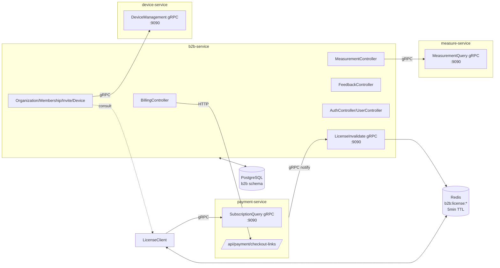
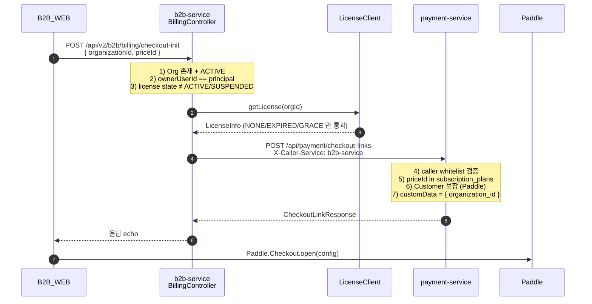
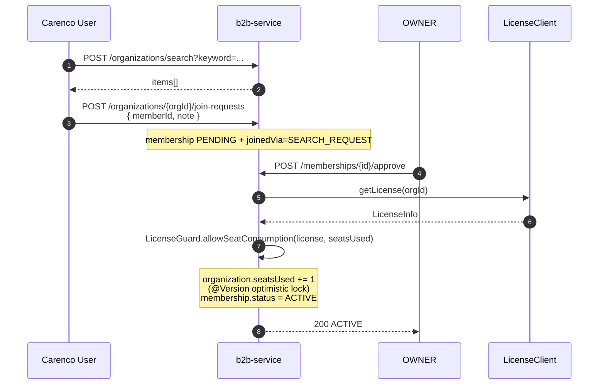
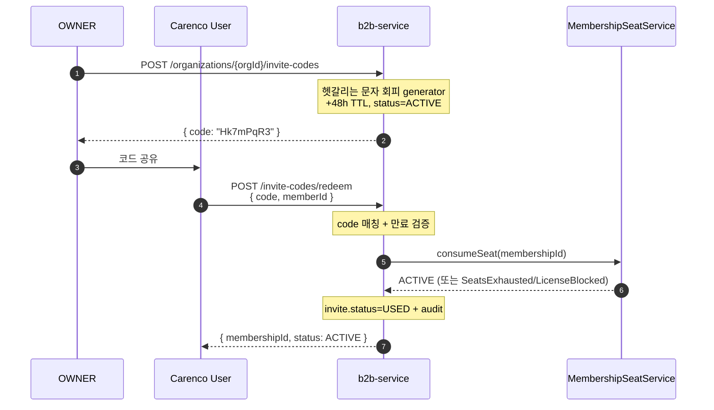
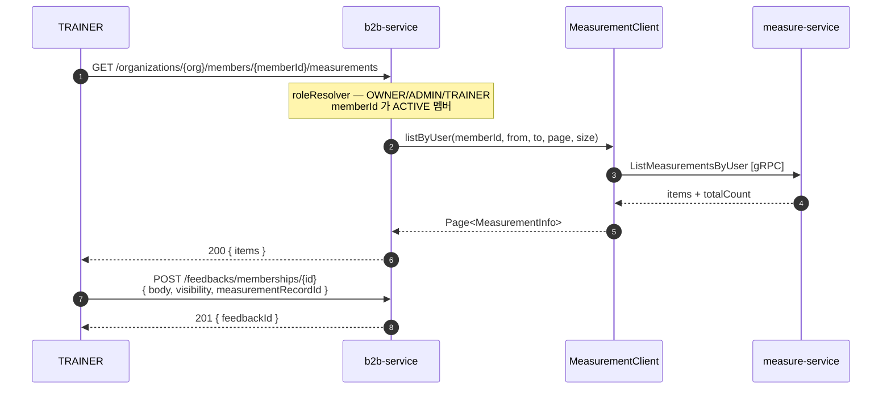
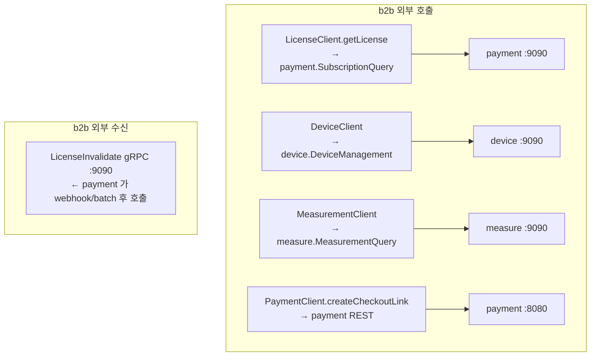
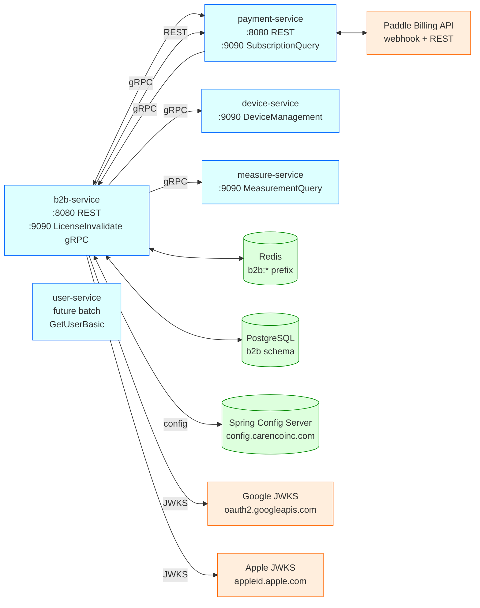
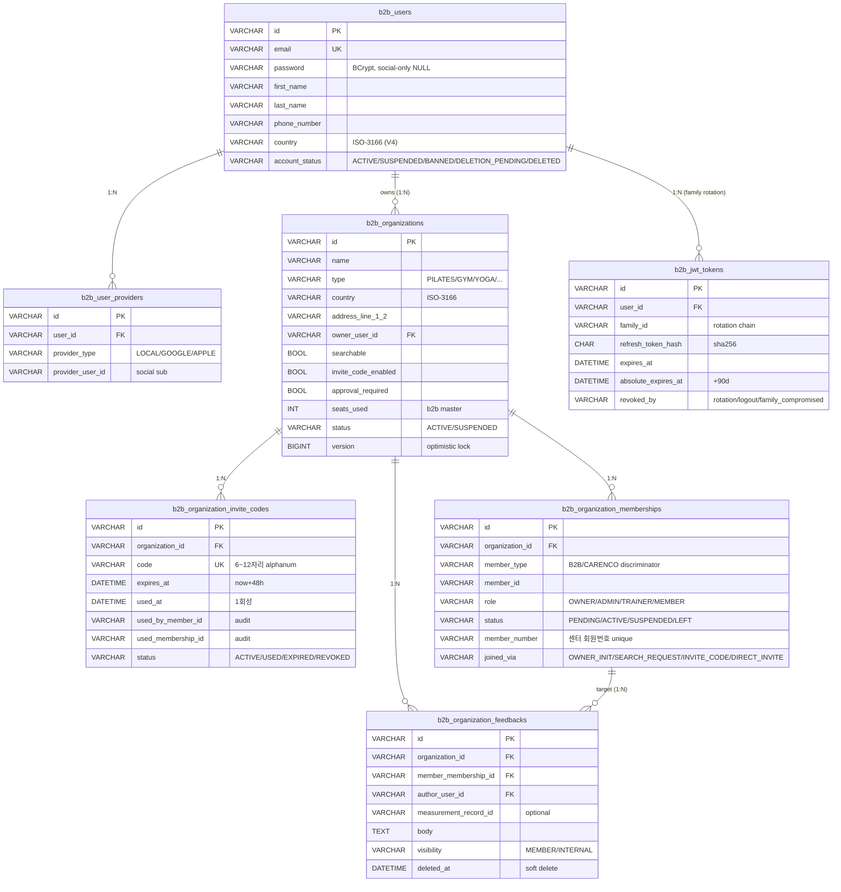

# B2B Service API

> Updated: 2026-05-06
> Style: OpenAPI 3.1 + diagrams + code chain mapping
> Base path: `/api/v2/b2b/...`
> 응답 envelope: [`CncResponse`](#cncresponse) (Pattern B)

---

## 1. 개요

운동 시설 (gym/pilates/yoga/PT_studio/crossfit/functional/boxing) B2B 관리 서비스. 관리자 계정 + 시설 + 멤버 + 디바이스 + 측정 데이터 노출 + 피드백 + 결제 진입점.

### 1.1 도메인

| 도메인 | 책임 |
|---|---|
| `auth` | 인증 / 세션 / JWT family rotation / OAuth2 (Google + Apple) |
| `user` | b2b_user (관장/스태프/트레이너) CRUD |
| `organization` | 시설 + 초대 코드 + 멤버십 lifecycle (master) |
| `feedback` | 트레이너 → 회원 피드백 (1:N 코멘트) |
| `external/license` | payment-service gRPC 소비 + Redis 캐시 + LicenseGuard + invalidate 수신 |
| `external/device` | device-service gRPC wrap |
| `external/measurement` | measure-service gRPC wrap |
| `external/payment` | payment-service REST 호출 (결제 시작) |
| `billing` | 결제 진입 — OWNER 검증 후 payment 위임 |

### 1.2 외부 의존



---

## 2. Architecture — Cross-MSA 데이터 흐름

### 2.1 결제 시작 (Billing)



### 2.2 회원 가입 + 좌석 점유 (검색 + 승인)



### 2.3 초대 코드 1회성 가입



### 2.4 측정 데이터 + 피드백 (트레이너)



### 2.5 License invalidate (양방향 sync)

```mermaid
sequenceDiagram
    Paddle->>P payment-service: subscription.canceled
    P->>P: subscriptions.status=CANCELED
    P->>+B b2b-service: InvalidateLicense(orgId) [gRPC]
    B->>Redis: DEL b2b:license:{orgId}
    B-->>-P: { invalidated: true }
    Note over Paddle,B: 다음 b2b 의 getLicense 호출 시<br/>새 상태 즉시 반영
```

### 2.6 자정 batch (PAST_DUE → EXPIRED)

```mermaid
sequenceDiagram
    Note over P: 매일 00:05 KST cron<br/>+ ShedLock JDBC 분산락
    P->>P: findByStatusAndNextBilledAtBefore(PAST_DUE, now-7d)
    P->>P: 모두 status=EXPIRED 로 update
    P->>+B b2b-service: InvalidateMany([orgIds]) [gRPC]
    B->>Redis: DEL multiple keys
    B-->>-P: { invalidatedCount, notCachedCount }
```

---

## 3. Endpoint Catalog (Domain x HTTP Method)

표기: 🔓 Public / 🔒 Auth / 👑 OWNER/ADMIN / 👥 OWNER/ADMIN/TRAINER

### 3.1 Auth

| Method | Path | 권한 | 코드 매핑 |
|---|---|---|---|
| POST | `/api/v2/b2b/auth/login` | 🔓 | `AuthController.login` → `AuthService.authenticateForToken/authenticateForSession` |
| POST | `/api/v2/b2b/auth/token` | 🔓 | `AuthController.refresh` → `JwtTokenService.rotateRefresh` |
| POST | `/api/v2/b2b/auth/logout` | 🔓 | `AuthController.logout` → `TokenRevocationService.revokeJti` |
| GET | `/api/v2/b2b/auth/me` | 🔒 | `AuthController.me` (간단 — `UserController.me` 가 detail) |
| POST | `/api/v2/b2b/auth/oauth2/google` | 🔓 | `OAuth2Controller.googleLogin` → `OAuth2LoginService` + `GoogleIdTokenVerifier` |
| POST | `/api/v2/b2b/auth/oauth2/apple` | 🔓 | `OAuth2Controller.appleLogin` → `OAuth2LoginService` + `AppleIdTokenVerifier` |

### 3.2 User

| Method | Path | 권한 | 코드 매핑 |
|---|---|---|---|
| POST | `/api/v2/b2b/users` | 🔓 | `UserController.signUp` → `UserService.signUp` |
| GET | `/api/v2/b2b/users/{b2bUserId}` | 🔒 (self) | `UserController.get` → `UserService.getMeWithOrganizations` (organization+license enrich) |
| PATCH | `/api/v2/b2b/users/{b2bUserId}` | 🔒 (self) | `UserController.update` → `UserService.updateProfile` |
| POST | `/api/v2/b2b/users/{b2bUserId}/password` | 🔒 (self) | `UserController.changePassword` → `UserService.changePassword` + `AuthService.revokeAllSessions` |
| DELETE | `/api/v2/b2b/users/{b2bUserId}` | 🔒 (self) | `UserController.delete` → `UserService.deleteAccount` |

**`b2bUserId` 검증**: path 의 ID 가 인증된 principal 과 일치해야 통과 (`UserController.ensureSelf`). 불일치 시 `403 PERMISSION_DENIED` ([`UserError.NotSelf`](#userresponse))

### 3.3 Organization

| Method | Path | 권한 | 코드 매핑 |
|---|---|---|---|
| POST | `/api/v2/b2b/organizations` | 🔒 | `OrganizationController.create` → `OrganizationService.create` |
| GET | `/api/v2/b2b/organizations/{id}` | 🔓 | `OrganizationController.get` → `OrganizationService.get` |
| PATCH | `/api/v2/b2b/organizations/{id}` | 👑 | `OrganizationController.update` → `OrganizationService.update` (owner check) |
| GET | `/api/v2/b2b/organizations/search` | 🔓 | `OrganizationController.search` → `OrganizationRepository.searchActive` |
| GET | `/api/v2/b2b/organizations/mine` | 🔒 | `OrganizationController.mine` → `OrganizationService.listByOwner` |

### 3.4 Membership

| Method | Path | 권한 | 코드 매핑 |
|---|---|---|---|
| POST | `/api/v2/b2b/organizations/{orgId}/join-requests` | 🔓 | `MembershipController.requestJoin` → `MembershipFlowService.requestJoin` |
| POST | `/api/v2/b2b/memberships/{id}/approve` | 👑 | `MembershipController.approve` → `MembershipFlowService.approve` → `MembershipSeatService.consumeSeat` |
| POST | `/api/v2/b2b/memberships/{id}/reject` | 👑 | `MembershipController.reject` → `MembershipFlowService.reject` |
| POST | `/api/v2/b2b/memberships/{id}/suspend` | 👑 | `MembershipController.suspend` → `MembershipFlowService.suspend` |
| POST | `/api/v2/b2b/memberships/{id}/leave` | 🔓 | `MembershipController.leave` → `MembershipFlowService.leave` (body의 requesterId 자기검증) |
| POST | `/api/v2/b2b/organizations/{orgId}/staff` | 👑 | `MembershipController.appointStaff` → `MembershipFlowService.appointB2bRole` |
| GET | `/api/v2/b2b/organizations/{orgId}/members?status=` | 🔒 | `MembershipController.listMembers` → `MembershipFlowService.listByOrganization` |

### 3.5 Invite Code

| Method | Path | 권한 | 코드 매핑 |
|---|---|---|---|
| POST | `/api/v2/b2b/organizations/{orgId}/invite-codes` | 👑 | `InviteCodeController.issue` → `InviteCodeService.issue` + `InviteCodeGenerator` |
| GET | `/api/v2/b2b/organizations/{orgId}/invite-codes` | 🔒 | `InviteCodeController.list` → `InviteCodeService.listActive` |
| POST | `/api/v2/b2b/invite-codes/redeem` | 🔓 | `InviteCodeController.redeem` → `InviteCodeService.redeem` → seat cascade |
| POST | `/api/v2/b2b/invite-codes/{id}/revoke` | 👑 | `InviteCodeController.revoke` → `InviteCodeService.revoke` |

### 3.6 Device

| Method | Path | 권한 | 코드 매핑 |
|---|---|---|---|
| POST | `/api/v2/b2b/organizations/{orgId}/devices` | 👑 | `DeviceController.register` → `DeviceClient.registerDevice` (gRPC → device-service) |
| GET | `/api/v2/b2b/organizations/{orgId}/devices` | 🔒 | `DeviceController.list` → `DeviceClient.listByOrganization` |
| GET | `/api/v2/b2b/organizations/{orgId}/devices/{deviceId}` | 🔒 | `DeviceController.get` → `DeviceClient.getDevice` |
| PATCH | `/api/v2/b2b/organizations/{orgId}/devices/{deviceId}` | 👑 | `DeviceController.update` → `DeviceClient.updateDevice` |
| POST | `/api/v2/b2b/organizations/{orgId}/devices/{deviceId}/deactivate` | 👑 | `DeviceController.deactivate` → `DeviceClient.deactivateDevice` |

### 3.7 Measurement

| Method | Path | 권한 | 코드 매핑 |
|---|---|---|---|
| GET | `.../members/{memberId}/measurements` | 👥 | `MeasurementController.list` → `MeasurementClient.listByUser` (gRPC) |
| GET | `.../measurements/{recordId}` | 👥 | `MeasurementController.get` → `MeasurementClient.get` |
| GET | `.../measurements/summary` | 👥 | `MeasurementController.summary` → `MeasurementClient.getSummary` |

(전체 path: `/api/v2/b2b/organizations/{orgId}/members/{memberId}/measurements/...`)

### 3.8 Feedback

| Method | Path | 권한 | 코드 매핑 |
|---|---|---|---|
| POST | `/api/v2/b2b/feedbacks/memberships/{id}` | 👥 | `FeedbackController.create` → `FeedbackService.create` |
| PATCH | `/api/v2/b2b/feedbacks/{id}` | 작성자 | `FeedbackController.edit` → `FeedbackService.edit` |
| DELETE | `/api/v2/b2b/feedbacks/{id}` | 작성자 또는 👑 | `FeedbackController.delete` → `FeedbackService.delete` (soft) |
| GET | `/api/v2/b2b/feedbacks/memberships/{id}` | 🔒 | `FeedbackController.listForMember` → `FeedbackService.listForMember` |
| GET | `/api/v2/b2b/feedbacks/measurements/{recordId}` | 🔒 | `FeedbackController.listForMeasurement` |

### 3.9 License Summary

| Method | Path | 권한 | 코드 매핑 |
|---|---|---|---|
| GET | `/api/v2/b2b/license-summary` | 🔒 | `LicenseSummaryController.mine` → 본인 owner+ACTIVE 멤버 organization 들 |
| GET | `/api/v2/b2b/license-summary/{orgId}` | 🔒 (멤버) | `LicenseSummaryController.get` → `LicenseClient.getLicense` + `MembershipRoleResolver` |

### 3.10 Billing

| Method | Path | 권한 | 코드 매핑 |
|---|---|---|---|
| POST | `/api/v2/b2b/billing/checkout-init` | 👑 (OWNER) | `BillingController.checkoutInit` → `BillingService.initCheckout` → `RestPaymentClient.createCheckoutLink` |

---

## 4. Endpoint Detail (선택 항목)

### 4.1 `POST /api/v2/b2b/billing/checkout-init`

> 결제 시작 진입점. b2b 가 권한 검증 후 payment-service 위임.

**Auth**: Bearer (b2b JWT) — OWNER 권한

**Request body**

```json
{ "organizationId": "org-uuid", "priceId": "pri_xxx" }
```

**Response — 200**

```json
{
  "success": true, "code": "200", "message": "OK",
  "data": {
    "items": [{ "priceId": "pri_xxx", "quantity": 1 }],
    "customer": { "email": "owner@example.com", "name": "박관장" },
    "customData": { "organization_id": "org-uuid" },
    "plan": {
      "planCode": "PILATES_BASIC", "planSeats": 50,
      "displayName": "필라테스 기본 (50석)",
      "amount": 99000, "currency": "KRW"
    },
    "paddleCustomerId": "ctm_xxx"
  }
}
```

**Errors** (`BillingError` sealed)

| HTTP | Error Code | 케이스 |
|---|---|---|
| 404 | `CMN-404-001` | OrganizationNotFound |
| 403 | `AUTH-403-002` | NotOwner |
| 403 | `AUTH-403-001` | OrganizationNotActive / LicenseSuspended |
| 409 | `CMN-409-001` | AlreadyHasActiveSubscription (state=ACTIVE) |
| 502 | `CMN-502-001` | PaymentServiceUnavailable |

**연쇄 호출**

```
BillingController → BillingService.initCheckout
  ├─ OrganizationRepository.findById
  ├─ LicenseClient.getLicense (Redis 캐시 우선)
  ├─ B2bUserRepository.findById (owner 본인)
  └─ PaymentClient.createCheckoutLink (HTTP → payment-service)
```

---

### 4.2 `POST /api/v2/b2b/memberships/{id}/approve`

> 가입 신청 PENDING → ACTIVE 전이 + 좌석 +1.

**Auth**: Bearer — OWNER/ADMIN

**Response — 200** — `MembershipResponse` (status=ACTIVE, joinedAt 채워짐)

**Errors** (`MembershipFlowError` sealed)

| HTTP | 케이스 |
|---|---|
| 404 | MembershipNotFound |
| 403 | NotOwnerOrAdmin |
| 409 | InvalidStateTransition / AlreadyMember |
| 403 | SeatConsumeFailed (license SUSPENDED / 만석) |

**연쇄 호출**

```
MembershipController → MembershipFlowService.approve
  ├─ MembershipRoleResolver.resolve (역할 확인)
  ├─ MembershipFlowService 내부 검증
  └─ MembershipSeatService.consumeSeat
       ├─ OrganizationRepository.findById
       ├─ LicenseClient.getLicense
       ├─ LicenseGuard.allowSeatConsumption
       ├─ organization.setSeatsUsed (+1, optimistic lock)
       └─ membership.setStatus(ACTIVE)
```

---

### 4.3 `POST /api/v2/b2b/invite-codes/redeem`

> Carenco user 가 코드로 1회성 가입.

**Auth**: 🔓 Public (body memberId 가 carenco userId)

**Request body**

```json
{ "code": "Hk7mPqR3", "memberId": "carenco-user-uuid" }
```

**Response — 200**

```json
{
  "success": true,
  "data": {
    "inviteCode": { "id": "...", "code": "Hk7mPqR3", "status": "USED",
                    "usedAt": "...", "usedByMemberId": "...", "usedMembershipId": "..." },
    "membershipId": "m-uuid",
    "organizationId": "org-uuid",
    "status": "ACTIVE"
  }
}
```

**Errors** (`InviteCodeError` sealed)

| HTTP | 케이스 |
|---|---|
| 404 | InviteCodeNotFound |
| 403 | InviteCodeExpired / InviteCodeNotActive |
| 409 | AlreadyMember |
| 403 | LicenseBlocked (SeatsExhausted 포함) |

**연쇄 호출**

```
InviteCodeController.redeem → InviteCodeService.redeem
  ├─ InviteCodeRepository.findByCode
  ├─ 만료 검증 (expiresAt < now)
  ├─ 중복 멤버 검증
  ├─ Membership PENDING row 생성
  └─ MembershipSeatService.consumeSeat (license guard + seats+1)
       └─ 성공 시 InviteCode.status=USED + audit
```

---

### 4.4 `GET /api/v2/b2b/users/{b2bUserId}`

> 본인 프로필 + 소속 organization (multi-org) + license 상태.
>
> `b2bUserId` 가 인증된 principal 과 일치해야 함 (불일치 시 403). user-service `/api/v2/users/{userId}` 와 일관 패턴.

**Response — 200**

```json
{
  "data": {
    "id": "u-uuid", "email": "owner@example.com",
    "firstName": "박", "lastName": "관장", "country": "KR",
    "accountStatus": "ACTIVE",
    "organizations": [
      { "id": "org-A", "name": "강남점", "type": "PILATES",
        "role": "OWNER", "seatsUsed": 12, "planSeats": 50, "licenseState": "ACTIVE" },
      { "id": "org-B", "name": "분당점", "type": "PILATES",
        "role": "ADMIN", "seatsUsed": 7, "planSeats": 30, "licenseState": "GRACE" }
    ]
  }
}
```

**연쇄 호출**

```
UserController.get → ensureSelf(pathUserId, principal)   // 403 if mismatch
            → UserService.getMeWithOrganizations
  ├─ B2bUserRepository.findById
  ├─ OrganizationRepository.findByOwnerUserId (OWNER orgs)
  ├─ OrganizationMembershipRepository.findByMemberTypeAndMemberId(B2B, userId)
  └─ LicenseClient.batchGetLicense (한 번에 조회)
       ├─ Redis cache hits → 즉시
       └─ miss → payment-service gRPC BatchGetLicenseStatus
```

---

(다른 endpoint detail 은 코드 매핑 표 (3절) 참조 — 모두 동일 Pattern B 응답 구조)

---

## 5. License Guard 매트릭스

`external/license/LicenseGuard.java` — 4종 결정.

| Operation | ACTIVE | GRACE | EXPIRED | SUSPENDED | NONE |
|---|---|---|---|---|---|
| 좌석 점유 (membership 가입) | ✅ (seats < plan) | ❌ | ❌ | ❌ | ❌ |
| 코드 발급 | ✅ | ✅ | ❌ | ❌ | ❌ |
| Device 등록 | ✅ | ✅ | ❌ | ❌ | ❌ |
| 일반 read (조회) | ✅ | ✅ | ✅ | ❌ | ✅ |

`getLicense` 실패 (payment-service 다운) → `LicenseInfo.none()` 반환 → 위 표의 NONE 컬럼 적용 → 좌석/코드/device write 차단, read 통과.

---

## 6. Cross-MSA 호출 정리



| 채널 | 주체 | endpoint | 빈도 | failure 정책 |
|---|---|---|---|---|
| b2b → payment (read) | LicenseClient | gRPC SubscriptionQuery.GetLicenseStatus | 모든 license guard 호출 (캐시 hit 시 미발생) | fail-open → NONE |
| b2b → payment (write) | PaymentClient | REST POST /checkout-links | billing/checkout-init 시 1회 | fail-fast → BillingError |
| b2b → device | DeviceClient | gRPC DeviceManagement | device CRUD 시 | read fail-open / write fail-fast |
| b2b → measure | MeasurementClient | gRPC MeasurementQuery | trainer 측정 조회 시 | fail-open (빈 결과) |
| payment → b2b | B2bLicenseInvalidateClient | gRPC LicenseInvalidate | webhook + 자정 batch | fail-open (b2b 가 5min TTL 자연 만료) |

---

## 7. Schemas

### CncResponse

```json
{
  "success": boolean,
  "code": "string (예: 200, CMN-404-001)",
  "message": "string (i18n resolved)",
  "data": <any>,
  "error": "string? (failure 시 description)",
  "token": "string? (TokenPair 등)"
}
```

### TokenPair

```json
{ "accessToken": "...", "refreshToken": "...", "expiresIn": 900 }
```

### OrganizationResponse

```json
{
  "id": "...", "name": "...", "type": "PILATES|GYM|YOGA|...",
  "description": "...", "phoneNumber": "...", "photoUrl": "...",
  "address": {
    "country": "KR", "postalCode": "06000",
    "regionLevel1": "서울", "regionLevel2": "강남구",
    "addressLine1": "...", "addressLine2": "..."
  },
  "ownerUserId": "...",
  "searchable": true, "inviteCodeEnabled": true, "approvalRequired": true,
  "seatsUsed": 12, "status": "ACTIVE"
}
```

### MembershipResponse

```json
{
  "id": "...", "organizationId": "...",
  "memberType": "B2B|CARENCO", "memberId": "...",
  "role": "OWNER|ADMIN|TRAINER|MEMBER",
  "status": "PENDING|ACTIVE|SUSPENDED|LEFT",
  "memberNumber": "M-001",
  "joinedVia": "OWNER_INIT|SEARCH_REQUEST|INVITE_CODE|DIRECT_INVITE",
  "inviteCodeId": "...?",
  "approvedBy": "...?", "approvedAt": "...?",
  "joinedAt": "...?", "leftAt": "...?",
  "note": "..."
}
```

### LicenseSummaryResponse

```json
{
  "organizationId": "...", "organizationName": "...",
  "state": "ACTIVE|GRACE|EXPIRED|SUSPENDED|NONE",
  "planCode": "PILATES_BASIC", "planSeats": 50,
  "seatsUsed": 12, "seatsRemaining": 38,
  "startedAt": "...", "expiresAt": "...",
  "graceRemainingDays": 0,
  "subscriptionId": "..."
}
```

### CheckoutLinkResponse (`PaymentCheckoutLinkResponse` echo)

```json
{
  "items": [{ "priceId": "pri_xxx", "quantity": 1 }],
  "customer": { "email": "...", "name": "..." },
  "customData": { "organization_id": "..." },
  "plan": { "planCode": "...", "planSeats": 50, "displayName": "...", "amount": 99000, "currency": "KRW" },
  "paddleCustomerId": "ctm_xxx?"
}
```

---

## 8. Error Code (`ErrorCode` enum, common-core)

| Code | HTTP | 사용처 |
|---|---|---|
| `CMN-400-001` | 400 | CHECK_PARAMETER (validation) |
| `CMN-400-002` | 400 | VALIDATION_FAILED |
| `AUTH-401-001` | 401 | TOKEN_INVALID |
| `AUTH-401-003` | 401 | AUTHENTICATION_FAILED (login fail, oauth2) |
| `AUTH-403-001` | 403 | ACCESS_DENIED (license/seat) |
| `AUTH-403-002` | 403 | PERMISSION_DENIED (role) |
| `AUTH-403-003` | 403 | ACCOUNT_DISABLED (DELETION_PENDING) |
| `CMN-404-001` | 404 | RESOURCE_NOT_FOUND |
| `USR-404-001` | 404 | USER_NOT_FOUND |
| `CMN-409-001` | 409 | DUPLICATE_REQUEST (이미 멤버 / 좌석 만석 / 상태 충돌) |
| `CMN-502-001` | 502 | EXTERNAL_SERVICE_ISSUE (payment 다운 등) |

---

## 9. Redis Namespace

```
b2b:revoked:jti:{jti}           access TTL (15min)   — JWT JTI revocation
b2b:blocked:user:{userId}       24h or longer        — 비밀번호 변경/탈퇴 시
b2b:license:{orgId}             5min                 — LicenseClient 캐시
spring:session:b2b:*            30min                — Spring Session
```

---

## 10. 인프라 / 외부 의존 요약



---

## 11. 데이터 모델 (b2b schema, PostgreSQL)



---

## 12. Build / Deploy

| 항목 | 값 |
|---|---|
| Java | 25 |
| Spring Boot | 4.0.6 |
| common-libs | `carencoPlatformVersion=0.0.46` |
| DB | PostgreSQL (TIMESTAMP(6) / VARCHAR / payment-service 와 같은 인스턴스, DB 분리) |
| Flyway | V1 init / V2 jwt / V3 feedback / V4 user country |
| Build | `./gradlew compileJava` (config-server 필요 시 dev profile + CONFIG_URI) |
| Postman | `b2b-service/postman/B2B-Service-API.postman_collection.json` (7 시나리오) |

---

## 13. 미구현 / 후속 (roadmap.md 참조)

| 항목 | 상태 |
|---|---|
| 회원 검색 cross-MSA 이름/전화 enrich | b2b 자체 데이터만 (member_number, joined_at) ✅ / user-service batch 미구현 ❌ |
| 측정 상태 필터 (측정 필요/미측정/측정 완료) | ❌ |
| 리포트 scope 분기 (ACTIVE/GRACE → full, EXPIRED → basic + locked_items) | ❌ |
| WebSocket/SSE 실시간 동기화 (회원 가입/측정 푸시) | ❌ |
| 회원 history (재가입 추적) | ❌ |

전체 로드맵: [`b2b-service/docs/roadmap.md`](../../../b2b-service/docs/roadmap.md)
